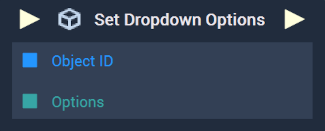

# Overview

The **Set Dropdown Options Node** sets a **Dropdown's** `Options` using an **Array**.

[**Scope**](../../overview.md#scopes): **Scene**, **Function**, **Prefab**.

# Inputs

|Input|Type|Description|
|---|---|---|
|*Pulse Input* (►)|**Pulse**|A standard **Input Pulse**, to trigger the execution of the **Node**.|
|`Object ID`|**ObjectID**|The **Dropdown** whose `Options` will be set.|
|`Options`|**Array**|The `Options` of the inputted **Dropdown** to be set.|

# Outputs

|Output|Type|Description|
|---|---|---|
|*Pulse Output* (►)|**Pulse**|A standard **Output Pulse**, to move onto the next **Node** along the **Logic Branch**, once this **Node** has finished its execution.|

# See Also

* [**Get Dropdown Options**](get-dropdown-options.md)
