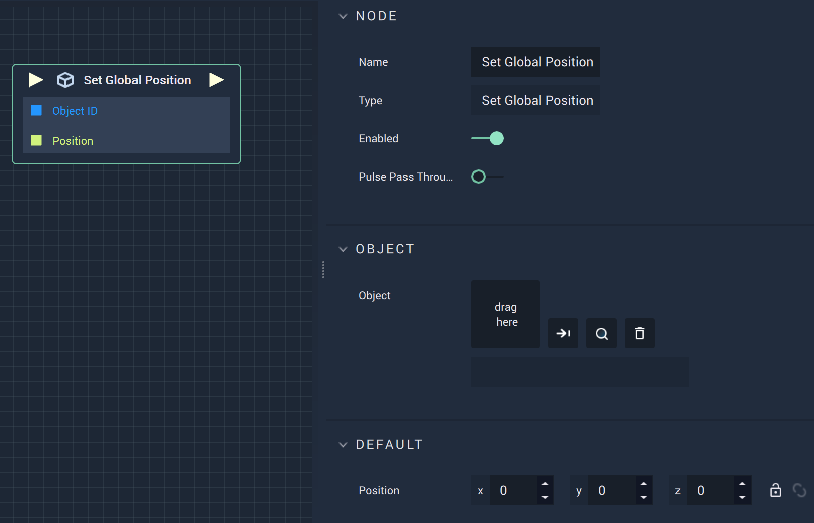

# Overview

The **Set Global Position Node** assigns the global coordinates (in reference to the origin)  for a **3D Object's** *global position* in **Vector3** form.

# Attributes

|Attribute|Type|Description|
|---|---|---|
|`Object`|**ObjectID**|The target **Object** whose `Global Position` you wish to assign, if one is not provided in the `Object ID` **Socket**.|
|`Position`|**Vector3**| A 3-dimensional **Vector** that provides the X and Y and Z _global position_ values for the target **Object**. |

# Inputs

|Input|Type|Description|
|---|---|---|
|*Pulse Input* (►)|**Pulse**|A standard **Input Pulse**, to trigger the execution of the **Node**.|
| `Object ID` | **ObjectID** | The ID of the target **Object** whose `Global Position` you wish to assign.|
|`Position`|**Vector3**| A 3-dimensional **Vector** that provides the X and Y and Z _global position_ values for the target **Object**. |

# Outputs

|Output|Type|Description|
|---|---|---|
|*Pulse Output* (►)|**Pulse**|A standard **Output Pulse**, to move onto the next **Node** along the **Logic Branch**, once this **Node** has finished its execution.|

# See Also

