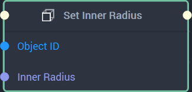

# Overview

The **Set Inner Radius Node** allows the user to set the `Inner Radius` of an [**Ellipse**](../../../objects-and-types/scene2d-objects/figma/figmaellipse.md).

[**Scope**](../../overview.md#scopes): **Scene**, **Function**, **Prefab**.

# Attributes

|Attribute|Type|Description|
|---|---|---|

# Inputs

|Input|Type|Description|
|---|---|---|
|*Pulse Input* (►)|**Pulse**|A standard **Input Pulse**, to trigger the execution of the **Node**.|

# Outputs

|Output|Type|Description|
|---|---|---|
|*Pulse Output* (►)|**Pulse**|A standard **Output Pulse**, to move onto the next **Node** along the **Logic Branch**, once this **Node** has finished its execution.|

# See Also

* [**Get Ellipse Arc Sector**](set-ellipse-arc-sector.md)
* [**Get Ellipse Start Angle**](get-ellipse-start-angle.md)
* [**Get Inner Radius**](get-inner-radius.md)
* [**Set Ellipse Arc Sector**](set-ellipse-arc-sector.md)
* [**Set Ellipse Start Angle**](set-ellipse-start-angle.md)
