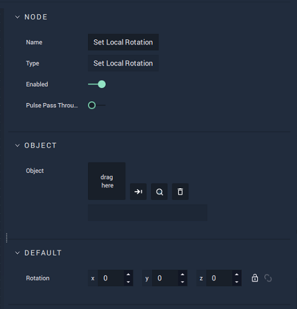

# Overview

The **Set Local Rotation Node** sets the value of a given **Object's** local `Rotation` **Attribute**.

[**Scope**](../../overview.md#scopes): **Scene**, **Function**, **Prefab**.

# Attributes

|Attribute|Type|Description|
|---|---|---|
|`Object`|**ObjectID**|The target **Object** whose local `Rotation` you wish to set, if one is not provided in the `Object ID` **Socket**.|
|`Rotation`|**Vector3**| A 3-dimensional **Vector** that provides the X, Y, and Z _local rotation_ values for the target **Object**. |

# Inputs

|Input|Type|Description|
|---|---|---|
|*Pulse Input* (►)|**Pulse**|A standard **Input Pulse**, to trigger the execution of the **Node**.|
| `Object ID` | **ObjectID** | The ID of the target **Object** whose local `Rotation` you wish to assign.|
|`Rotation`|**Vector3**| A 3-dimensional **Vector** that provides the X, Y, and Z _local rotation_ values for the target **Object**. |

# Outputs

|Output|Type|Description|
|---|---|---|
|*Pulse Output* (►)|**Pulse**|A standard **Output Pulse**, to move onto the next **Node** along the **Logic Branch**, once this **Node** has finished its execution.|

# See Also

<!-- * [**Global and Local Transforms**]() -->
* [**Set Local Position**](set-local-position.md)
* [**Get Local Position**](get-local-position.md)
* [**Get Local Rotation**](get-local-rotation.md)

## External Links

* [_Rotation_](https://en.wikipedia.org/wiki/Euler_angles) on Wikipedia.

