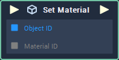

# Set Material

## Overview

**Set Material** assigns a **Material** to a [**Mesh** **Object**](../../../getting-started/scene-objects/mesh.md).

## Attributes

| Attribute | Type | Description |
| :--- | :--- | :--- |
| `Object` | **ObjectID** | The **Mesh Object**, to which the **Material** is to be applied to, if one is not provided in the `Object ID` **Socket**. |
| `Default Material` | **MaterialID** | The default value of the `Material` **Socket**, if no value is provided. |

## Inputs

| Input | Type | Description |
| :--- | :--- | :--- |
| _Pulse Input_ \(►\) | **Pulse** | A standard **Input Pulse**, to trigger the execution of the **Node**. |
| `Object ID` | **ObjectID** | The ID of the **Mesh Object** you would like to assign the **Material** to. |
| `Material ID` | **CustomID** | The **Material** to be applied to the **Mesh** **Object**. |

## Outputs

| Output | Type | Description |
| :--- | :--- | :--- |
| _Pulse Output_ \(►\) | **Pulse** | A standard **Output Pulse**, to move onto the next **Node** along the **Logic Branch**, once this **Node** has finished its execution. |

## See Also

* [**Get Material**](get-material.md)
* [**Mesh**](../../../getting-started/scene-objects/mesh.md)

