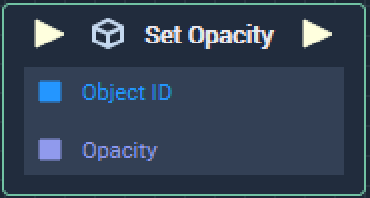

# Set Opacity

## Overview

**Set Opacity** sets the _opacity_ of an **Object** in a **Scene**. **Object ID** and **Opacity** are given as inputs to the **Node**.

## Attributes

| Attribute | Type | Description |
| :--- | :--- | :--- |
| `Object` | **ObjectID** | The target **Object**, whose `Opacity` you wish to set, if one is not provided in the `Object ID` **Socket**. |
| `Opacity` | **Float** | The _opacity value_ you wish to set for the target **Object**. |

## Inputs

| Input | Type | Description |
| :--- | :--- | :--- |
| _Pulse Input_ \(►\) | **Pulse** | A standard **Input Pulse**, to trigger the execution of the **Node**. |
| `Object ID` | **ObjectID** | The ID of the target **Object** whose `Opacity` you wish to set. |
| `Opacity` | **Float** | The _opacity value_ you wish to set for the target **Object**. |

## Outputs

| Output | Type | Description |
| :--- | :--- | :--- |
| _Pulse Output_ \(►\) | **Pulse** | A standard **Output Pulse**, to move onto the next **Node** along the **Logic Branch**, once this **Node** has finished its execution. |

## See Also

* [**Get Opacity**](get-opacity.md)

## External Links

* [_Transparency \(graphic\)_](https://en.wikipedia.org/wiki/Transparency_%28graphic%29) on Wikipedia.

