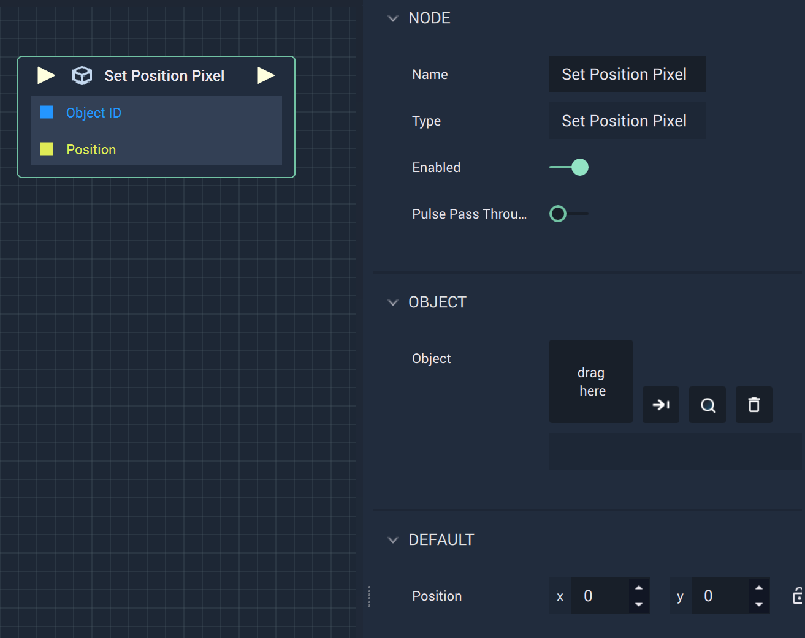

# Set Position Pixel

## Overview

**Set Position Pixel Node** sets the X and Y values of a **2D Object's** `Position`.

## Attributes

| Attribute | Type | Description |
| :--- | :--- | :--- |
| `Object` | **ObjectID** | The target **Object** whose `Position` you wish to set, if one is not provided in the `Object ID` **Socket**. |
| `Position` | **Vector2** | The desired `Position` values of the **Object**, if one is not provided in the `Position` **Socket**. |

## Inputs

| Input | Type | Description |
| :--- | :--- | :--- |
| _Pulse Input_ \(►\) | **Pulse** | A standard **Input Pulse**, to trigger the execution of the **Node**. |
| `Object ID` | **ObjectID** | The ID of the target **Object** whose `Position` you wish to set. |
| `Position` | **Vector2** | A 2-dimensional **Vector** that contains X and Y `Position` values of the target **Object**. |

## Outputs

| Output | Type | Description |
| :--- | :--- | :--- |
| _Pulse Output_ \(►\) | **Pulse** | A standard **Output Pulse**, to move onto the next **Node** along the **Logic Branch**, once this **Node** has finished its execution. |

## See Also

* [**Set Rotation 2D**](set-rotation-pixel.md)
* [**Set Size Pixel**](set-size-pixel.md)

