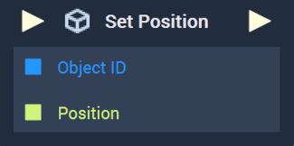
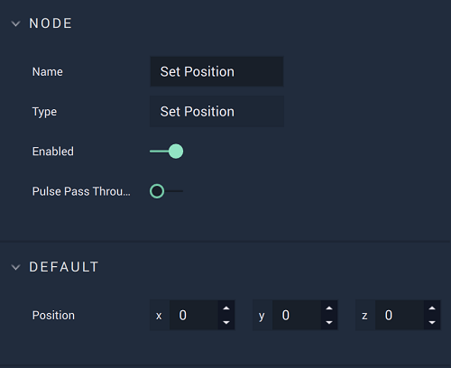
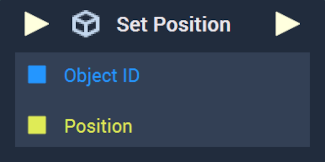

# Set Position

This **Node** has different versions for [**Scenes**](../../../objects-and-types/project-objects/scene.md) and [**Scene2Ds**](../../../objects-and-types/project-objects/scene2d.md). Find in the tabs below the documentation for both versions.





## Overview

**Set Position** sets the $$X$$, $$Y$$, and $$Z$$ values of a given **Object's** `Position` **Attribute**.

[**Scope**](../../overview.md#scopes): **Scene**, **Function**, **Prefab**.

## Attributes

| Attribute | Type | Description |
| :--- | :--- | :--- |
| `Position` | **Vector3** | The desired `Position` values of the **Object**, if one is not provided in the `Position` **Socket**. |

## Inputs

| Input | Type | Description |
| :--- | :--- | :--- |
| _Pulse Input_ \(►\) | **Pulse** | A standard **Input Pulse**, to trigger the execution of the **Node**. |
| `Object ID` | **ObjectID** | The ID of the target **Object** whose `Position` you wish to set. |
| `Position` | **Vector3** | A 3-dimensional **Vector** that contains the desired $$X$$, $$Y$$, and $$Z$$ values of the target **Object's** position. |

## Outputs

| Output | Type | Description |
| :--- | :--- | :--- |
| _Pulse Output_ \(►\) | **Pulse** | A standard **Output Pulse**, to move onto the next **Node** along the **Logic Branch**, once this **Node** has finished its execution. |




## Overview

**Set Position Node** sets the $$X$$ and $$Y$$ values of a **2D Object's** `Position`.

[**Scope**](../../overview.md#scopes): **Scene**, **Function**, **Prefab**.

## Attributes

| Attribute | Type | Description |
| :--- | :--- | :--- |
| `Position` | **Vector2** | The desired `Position` values of the **Object**, if one is not provided in the `Position` **Socket**. |

## Inputs

| Input | Type | Description |
| :--- | :--- | :--- |
| _Pulse Input_ \(►\) | **Pulse** | A standard **Input Pulse**, to trigger the execution of the **Node**. |
| `Object ID` | **ObjectID** | The ID of the target **Object** whose `Position` you wish to set. |
| `Position` | **Vector2** | A 2-dimensional **Vector** that contains the desired $$X$$ and $$Y$$ values of the target **Object's** position. |

## Outputs

| Output | Type | Description |
| :--- | :--- | :--- |
| _Pulse Output_ \(►\) | **Pulse** | A standard **Output Pulse**, to move onto the next **Node** along the **Logic Branch**, once this **Node** has finished its execution. |





## See Also

* [**Get Rotation**](get-rotation.md)
* [**Get Scale**](get-scale.md)
* [**Get Position**](get-position.md)

## External Links

* [_Position \(geometry\)_](https://en.wikipedia.org/wiki/Position_%28geometry%29) on Wikipedia.

