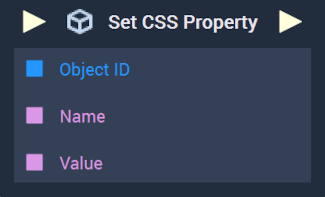
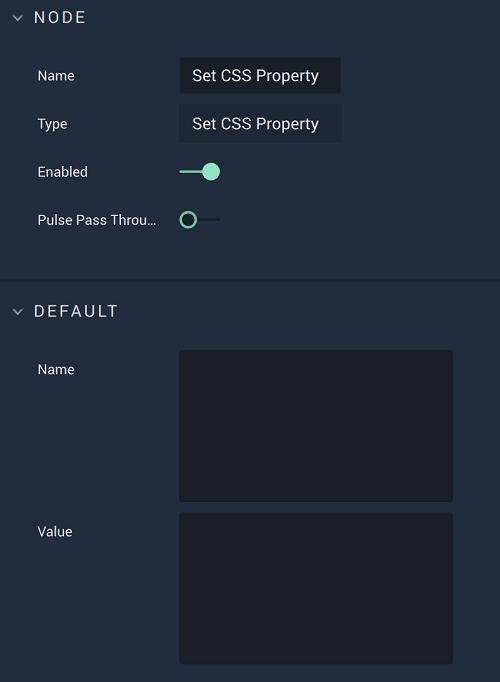

# Overview

The **Set CSS Property Node** sets the value of a single *CSS* property  of an **Object** provided by the user.

[**Scope**](../../overview.md#scopes): **Scene**, **Function**, **Prefab**.

# Attributes

|Attribute|Type|Description|
|---|---|---|
|`Name`|**String**|The name of the property to be set, if one is not provided in the **Input Socket**.|
|`Value`|**String**|The value of the property to be set, if one is not provided in the **Input Socket**.|

# Inputs

|Input|Type|Description|
|---|---|---|
|*Pulse Input* (►)|**Pulse**|A standard **Input Pulse**, to trigger the execution of the **Node**.|
|`Object ID`|**ObjectID**|The **Object** whose property will be set.|
|`Name`|**String**|The name of the property to be set.|
|`Value`|**String**|The value of the property to be set.|

# Outputs

|Output|Type|Description|
|---|---|---|
|*Pulse Output* (►)|**Pulse**|A standard **Output Pulse**, to move onto the next **Node** along the **Logic Branch**, once this **Node** has finished its execution.|

# See Also

* [**Get CSS Property**](get-property.md)

# External Links

* More about *CSS* on [Wikipedia](https://en.wikipedia.org/wiki/CSS)
