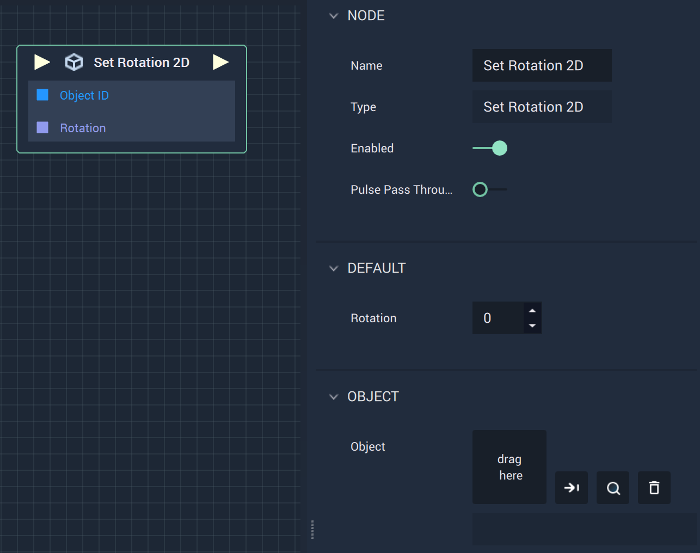

# Overview

The **Set Rotation 2D Node** sets the *degree of rotation* of a **2D** or **Vector2D Object**.

# Attributes

|Attribute|Type|Description|
|---|---|---|
|`Rotation`|**Float**|The desired *degree of rotation* of the **Object**, if one is not provided in the `Rotation` **Socket**.|
|`Object`|**ObjectID** | The target **Object** whose `Rotation` you wish to set, if one is not provided in the `Object ID` **Socket**.|
# Inputs

|Input|Type|Description|
|---|---|---|
|*Pulse Input* (►)|**Pulse**|A standard **Input Pulse**, to trigger the execution of the **Node**.|
| `Object ID` | **ObjectID** | The ID of the target **Object** whose `Rotation` you wish to set. |
| `Rotation` | **Float** | The desired **Float** value you wish to set for the **Object's** `Rotation`.|

# Outputs

|Output|Type|Description|
|---|---|---|
|*Pulse Output* (►)|**Pulse**|A standard **Output Pulse**, to move onto the next **Node** along the **Logic Branch**, once this **Node** has finished its execution.|

# See Also

# External Links

