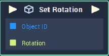

# Overview

**Set Rotation** sets the rotation of an **Object** in a **Scene**.

# Attributes

|Attribute|Type|Description|
|---|---|---|
|`Object`|**ObjectID**|The **Object** whose *rotation* is to be set in the **Scene**, if one is not provided in the `object ID` **Socket**.|
|`Default Rotation`|**Vector3**|The default value of the `Rotation` **Socket**, if no value is provided.|

# Inputs

|Input|Type|Description|
|---|---|---|
|*Pulse Input* (►)|**Pulse**|A standard **Input Pulse**, to trigger the execution of the **Node**.|
|`Object`|**ObjectID**|The ID of the **Object** you would like to `Set` a  `Rotation` value.|
|`Rotation`|**Vector3**|The input `Rotation` you would like to set for the **Object** in a **Scene**.|

# Outputs

|Output|Type|Description|
|---|---|---|
|*Pulse Output* (►)|**Pulse**|A standard **Output Pulse**, to move onto the next **Node** along the **Logic Branch**, once this **Node** has finished its execution.|

# See Also
- [**Get Scale**](get-scale.md)
- [**Get Position**](get-position.md)
- [**Get Rotation**](get-position.md)
  
# External Links
- [*Rotation*](https://en.wikipedia.org/wiki/Rotation_matrix) on wikipedia
- [*Rotation*](https://www.khanacademy.org/computing/computer-programming/programming-games-visualizations/programming-3d-shapes/a/rotating-3d-shapes) on Khan Academy

