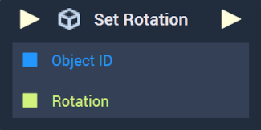
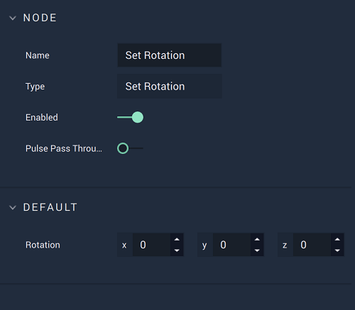
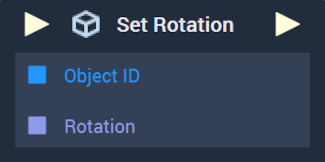
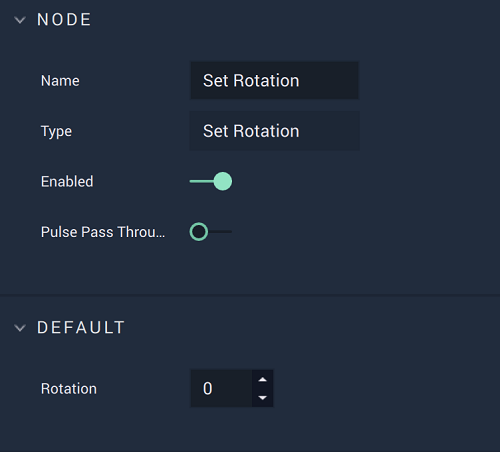

# Set Rotation

This **Node** has different versions for [**Scenes**](../../../objects-and-types/project-objects/scene.md) and [**Scene2Ds**](../../../objects-and-types/project-objects/scene2d.md). Find in the tabs below the documentation for both versions.



### Overview

**Set Rotation** sets the value of a given **Scene Object's** `Rotation` **Attribute**.

[**Scope**](../../overview.md#scopes): **Scene**, **Function**, **Prefab**.

### Attributes

| Attribute  | Type        | Description                                                                                                 |
| ---------- | ----------- | ----------------------------------------------------------------------------------------------------------- |
| `Rotation` | **Vector3** | The desired `Rotation` values of the **Scene Object**, if one is not provided in the `Rotation` **Socket**. |

### Inputs

| Input             | Type         | Description                                                                                                                                        |
| ----------------- | ------------ | -------------------------------------------------------------------------------------------------------------------------------------------------- |
| _Pulse Input_ (►) | **Pulse**    | A standard **Input Pulse**, to trigger the execution of the **Node**.                                                                              |
| `Object ID`       | **ObjectID** | The ID of the target **Scene Object** whose `Rotation` value you wish to set.                                                                      |
| `Rotation`        | **Vector3**  | A 3-dimensional vector that contains the `Rotation` components measured in Euler angles along the X, Y, and Z axes of the target **Scene Object**. |

### Outputs

| Output             | Type      | Description                                                                                                                            |
| ------------------ | --------- | -------------------------------------------------------------------------------------------------------------------------------------- |
| _Pulse Output_ (►) | **Pulse** | A standard **Output Pulse**, to move onto the next **Node** along the **Logic Branch**, once this **Node** has finished its execution. |



### Overview

**Set Rotation** sets the value of a given **Scene2D Object's** `Rotation` **Attribute**.

[**Scope**](../../overview.md#scopes): **Scene**, **Function**, **Prefab**.

### Attributes

| Attribute  | Type      | Description                                                                                                  |
| ---------- | --------- | ------------------------------------------------------------------------------------------------------------ |
| `Rotation` | **Float** | The desired `Rotation` value of the **Scene2D Object**, if one is not provided in the `Rotation` **Socket**. |

### Inputs

| Input             | Type         | Description                                                                     |
| ----------------- | ------------ | ------------------------------------------------------------------------------- |
| _Pulse Input_ (►) | **Pulse**    | A standard **Input Pulse**, to trigger the execution of the **Node**.           |
| `Object ID`       | **ObjectID** | The ID of the target **Scene2D Object** whose `Rotation` value you wish to set. |
| `Rotation`        | **Float**    | The **Float** value of the target **Scene2D Object's** rotation.                |

### Outputs

| Output             | Type      | Description                                                                                                                            |
| ------------------ | --------- | -------------------------------------------------------------------------------------------------------------------------------------- |
| _Pulse Output_ (►) | **Pulse** | A standard **Output Pulse**, to move onto the next **Node** along the **Logic Branch**, once this **Node** has finished its execution. |



## See Also

* [**Get Scale**](get-scale.md)
* [**Get Position**](get-position.md)
* [**Get Rotation**](get-position.md)

## External Links

* [_Rotation_](https://en.wikipedia.org/wiki/Euler\_angles) on Wikipedia.
