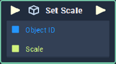

# Set Scale

## Overview

**Set Scale** sets the value of a given **Object's** `Scale` **Attribute**.

## Attributes

| Attribute | Type | Description |
| :--- | :--- | :--- |
| `Object` | **ObjectID** | The ID of the **Object**, whose `Scale` you would like to set, if one is not provided in the `Object ID` **Socket**. |
| `Scale` | **Vector3** | The desired `Scale` value of the **Object**, if one is not provided in the `Scale` **Socket**. |

## Inputs

| Input | Type | Description |
| :--- | :--- | :--- |
| _Pulse Input_ \(►\) | **Pulse** | A standard **Input Pulse**, to trigger the execution of the **Node**. |
| `Object ID` | **ObjectID** | The ID of the **Object** whose `Scale` you would like to set. |
| `Scale` | **Vector3** | The desired `Scale` value of the **Object**. |

## Outputs

| Output | Type | Description |
| :--- | :--- | :--- |
| _Pulse Output_ \(►\) | **Pulse** | A standard **Output Pulse**, to move onto the next **Node** along the **Logic Branch**, once this **Node** has finished its execution. |

## See Also

* [**Get Scale**](get-scale.md)

## External Links

* [_Scaling \(geometry\)_](https://en.wikipedia.org/wiki/Scaling_%28geometry%29) on Wikipedia.

