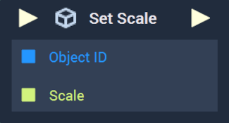
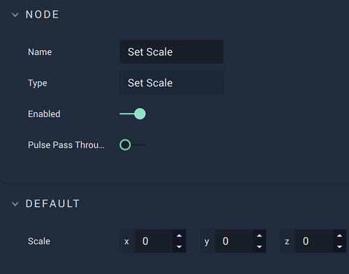

# Set Scale

This **Node** is only useable in [**Scenes**](../../../objects-and-types/project-objects/scene.md) and not **Scene2Ds**.

## Overview

**Set Scale** sets the values of a given **Scene Object's** `Scale` **Attribute**.

[**Scope**](../../overview.md#scopes): **Scene**, **Function**, **Prefab**.

## Attributes

| Attribute | Type | Description |
| :--- | :--- | :--- |
| `Scale` | **Vector3** | The desired `Scale` values of the **Scene Object**, if not provided in the `Scale` **Socket**. |

## Inputs

| Input | Type | Description |
| :--- | :--- | :--- |
| _Pulse Input_ \(►\) | **Pulse** | A standard **Input Pulse**, to trigger the execution of the **Node**. |
| `Object ID` | **ObjectID** | The ID of the **Scene Object** whose `Scale` you would like to set. |
| `Scale` | **Vector3** | The desired `Scale` values of the **Scene Object**. |

## Outputs

| Output | Type | Description |
| :--- | :--- | :--- |
| _Pulse Output_ \(►\) | **Pulse** | A standard **Output Pulse**, to move onto the next **Node** along the **Logic Branch**, once this **Node** has finished its execution. |

## See Also

* [**Get Scale**](get-scale.md)

## External Links

* [_Scaling \(geometry\)_](https://en.wikipedia.org/wiki/Scaling_%28geometry%29) on Wikipedia.

