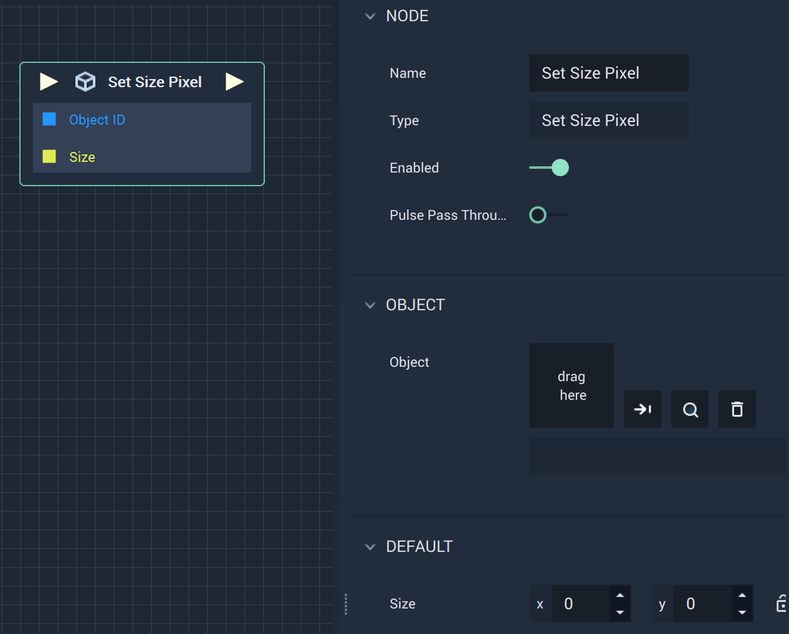

# Set Size Pixel

## Overview

The **Set Size Pixel Node** sets the _X_ and _Y values_ of a **2D Object's** `Size`.

## Attributes

| Attribute | Type | Description |
| :--- | :--- | :--- |
| `Object` | **ObjectID** | The target **Object** whose `Size` you wish to set, if one is not provided in the `Object ID` **Socket**. |
| `Size` | **Vector2** | The desired `Size` values of the **Object**, if one is not provided in the `Size` **Socket**. |

## Inputs

| Input | Type | Description |
| :--- | :--- | :--- |
| _Pulse Input_ \(►\) | **Pulse** | A standard **Input Pulse**, to trigger the execution of the **Node**. |
| `Object ID` | **ObjectID** | The ID of the target **Object** whose `Size` you wish to set. |
| `Size` | **Vector2** | A 2-dimensional **Vector** that contains _X_ and _Y_ `Size` _values_ of the target **Object**. |

## Outputs

| Output | Type | Description |
| :--- | :--- | :--- |
| _Pulse Output_ \(►\) | **Pulse** | A standard **Output Pulse**, to move onto the next **Node** along the **Logic Branch**, once this **Node** has finished its execution. |

## See Also

* [**Set Position Pixel**](set-position-pixel.md)
* [**Set Rotation 2D**](set-rotation-pixel.md)

