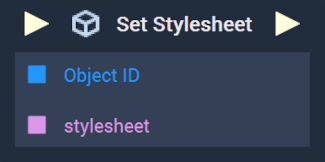
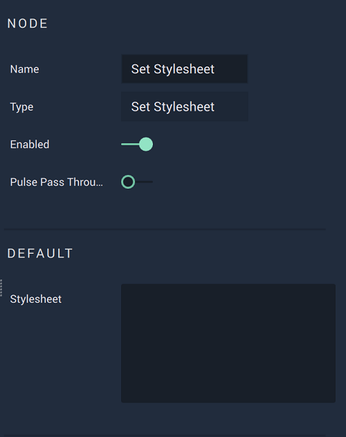

# Overview

The **Set Stylesheet Node** allows the user to apply a customized *CSS* stylesheet to a **2D** **Object**.

[**Scope**](../../overview.md#scopes): **Scene**, **Function**.

# Attributes

|Attribute|Type|Description|
|---|---|---|
|`Stylesheet`|**String**|The customized stylesheet for the desired **Object**, if one is not provided in the **Input Socket**.|

# Inputs

|Input|Type|Description|
|---|---|---|
|*Pulse Input* (►)|**Pulse**|A standard **Input Pulse**, to trigger the execution of the **Node**.|
|`Object ID`|**ObjectID**|The **Object** that will have the stylesheet applied to it.|
|`stylesheet`|**String**|The stylesheet that will be applied to the **Object**.|

# Outputs

|Output|Type|Description|
|---|---|---|
|*Pulse Output* (►)|**Pulse**|A standard **Output Pulse**, to move onto the next **Node** along the **Logic Branch**, once this **Node** has finished its execution.|

