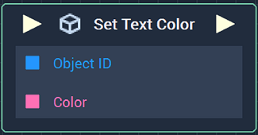
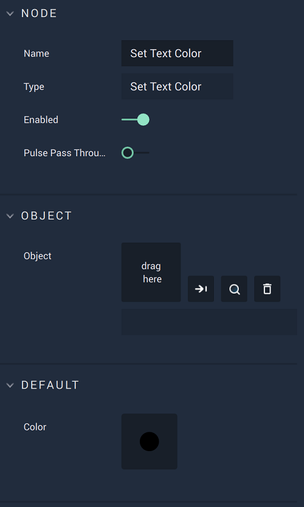

# Overview

The **Set Text Color Node** sets, or changes, the **Color** of a **Text Object**.

[**Scope**](../../overview.md#scopes): **Scene**, **Function**, **Prefab**.

# Attributes

|Attribute|Type|Description|
|---|---|---|
|`Object`|**ObjectID**|The **Text** **Object** whose **Color** will be set, if one is not provided in the `Object ID` **Socket**.|
|`Color`|**Color**|The **Color** to be set, if one is not provided in the `Color` **Socket**. 

# Inputs

|Input|Type|Description|
|---|---|---|
|*Pulse Input* (►)|**Pulse**|A standard **Input Pulse**, to trigger the execution of the **Node**.|
|`Object ID`|**ObjectID**|The **Text** **Object** whose **Color** will be set.|
|`Color`|**Color**|The **Color** to be set.|

# Outputs

|Output|Type|Description|
|---|---|---|
|*Pulse Output* (►)|**Pulse**|A standard **Output Pulse**, to move onto the next **Node** along the **Logic Branch**, once this **Node** has finished its execution.|

# See Also

* [**Get Text Color**](get-text-color.md)

