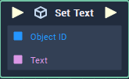

# Overview

**Set Text** sets the text ofa **Text** **Object**.

The **Set Text** node only works for **Text Objects**.

# Attributes

|Attribute|Type|Description|
|---|---|---|
|`Object`|**ObjectID**|The **Text** **Object** whose `Text` **Attribute**'s value is to be set if one is not provided in the `Object ID` **Socket**.|
|`Default Text`|**String**|The default value of the **Text Object**, if no value is provided.|

# Inputs

|Input|Type|Description|
|---|---|---|
|*Pulse Input* (►)|**Pulse**|A standard **Input Pulse**, to trigger the execution of the **Node**.|
|`Object ID`|**ObjectID**|The ID of the **Text** **Object**.|
|`Text`|**String**|The desired value of the **Text Object**'s `Text` **Attribute**.|

# Outputs

|Output|Type|Description|
|---|---|---|
|*Pulse Output* (►)|**Pulse**|A standard **Output Pulse**, to move onto the next **Node** along the **Logic Branch**, once this **Node** has finished its execution.|

# See Also
- [**Get Text**](get-text.md)
- [**Text**](objects/scene-objects/sprites/text.md)

# External Links
- [*Strings*](https://en.wikipedia.org/wiki/String_(computer_science))
