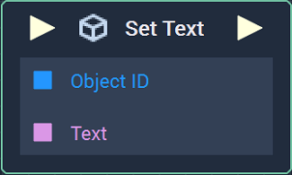
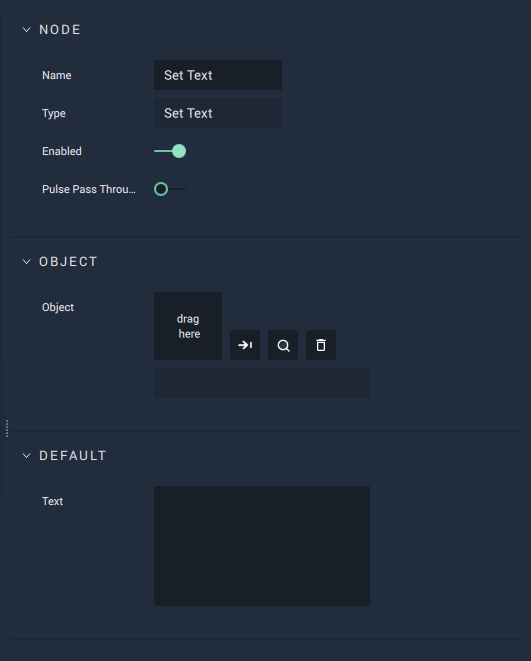

# Set Text

## Overview

**Set Text** sets the text of a **Text** **Object**.

## Attributes

| Attribute | Type | Description |
| :--- | :--- | :--- |
| `Object` | **ObjectID** | The **Text** **Object**, whose `Text` **Attribute** value is to be set, if one is not provided in the `Object ID` **Socket**. |
| `Default Text` | **String** | The default value of the **Text Object**, if no value is provided. |

## Inputs

| Input | Type | Description |
| :--- | :--- | :--- |
| _Pulse Input_ \(►\) | **Pulse** | A standard **Input Pulse**, to trigger the execution of the **Node**. |
| `Object ID` | **ObjectID** | The ID of the **Text** **Object**. |
| `Text` | **String** | The desired value of the **Text Object's** `Text` **Attribute**. |

## Outputs

| Output | Type | Description |
| :--- | :--- | :--- |
| _Pulse Output_ \(►\) | **Pulse** | A standard **Output Pulse**, to move onto the next **Node** along the **Logic Branch**, once this **Node** has finished its execution. |

## See Also

* [**Text**](../../../getting-started/scene-objects/text.md)

## External Links

* [_String \(computer science\)_](https://en.wikipedia.org/wiki/String_%28computer_science%29) on Wikipedia.

