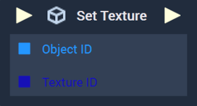
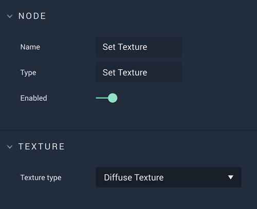

# Overview

The **Set Texture Node** applies a given *texture* to an **Object**. This is only possible for **Objects** which have either a `Diffuse Texture` or `Opacity Map` **Attribute**, either of which can be specified in the **Node's** **Attributes**. These can be applied in the **Logic Editor** by dragging the desired **Asset** from the [**Asset Database**](../../../modules/asset-database.md) (which can be populated with **Assets** by dragging them from the [**Asset Mananger**](../../../modules/asset-manager.md)). 

[**Scope**](../../overview.md#scopes): **Scene**, **Function**, **Prefab**.

# Attributes

|Output|Type|Description|
|---|---|---|
|*Pulse Output* (►)|**Pulse**|A standard **Output Pulse**, to move onto the next **Node** along the **Logic Branch**, once this **Node** has finished its execution.|
|`Texture type` | Drop-Down|The user selects either `Diffuse Texture` or `Opacity Map` depending on the required **Attribute** of the given **Object**.|

# Inputs

|Output|Type|Description|
|---|---|---|
|*Pulse Output* (►)|**Pulse**|A standard **Output Pulse**, to move onto the next **Node** along the **Logic Branch**, once this **Node** has finished its execution.|
| `Object ID` | **ObjectID** |The **Object** that will have its *texture* set.|
|`Texture ID` | **TextureID** |The desired *texture* that will be set for the selected **Object**.|

# Outputs

|Output|Type|Description|
|---|---|---|
|*Pulse Output* (►)|**Pulse**|A standard **Output Pulse**, to move onto the next **Node** along the **Logic Branch**, once this **Node** has finished its execution.|

