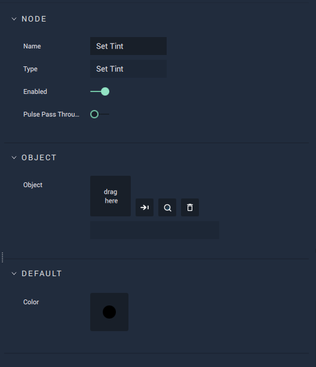

# Set Tint

## Overview

**Set Tint** modifies the `Tint` attribute of an **Object**.

The **Set Tint** **Node** only works with objects that have **Sprite** category as an **Attribute** such as [**List**](../../../objects-and-types/scene-objects/list-widget.md), **Image**, **Sequence**, **Web Sprite**, [**Sprite**](../../../objects-and-types/scene-objects/sprite.md) and [**Text**](../../../objects-and-types/scene-objects/text.md).

[**Scope**](../overview.md#scopes):
*  **Scene**, **Function**, **Prefab**

## Attributes

| Attribute | Type | Description |
| :--- | :--- | :--- |
| `Object` | **ObjectID** | The **Object**, whose color is to be adjusted, if one is not provided in the `Object ID` **Socket**. |
| `Color` | **Color** | The default value of the `Color` **Socket**, if no value is provided. |

## Inputs

| Input | Type | Description |
| :--- | :--- | :--- |
| _Pulse Input_ \(►\) | **Pulse** | A standard **Input Pulse**, to trigger the execution of the **Node**. |
| `Object ID` | **ObjectID** | The ID of the **Object** whose `Tint` you would like to set. |
| `Color` | **Color** | The `Tint` value used to adjust the  color of the **Object**. |

## Outputs

| Output | Type | Description |
| :--- | :--- | :--- |
| _Pulse Output_ \(►\) | **Pulse** | A standard **Output Pulse**, to move onto the next **Node** along the **Logic Branch**, once this **Node** has finished its execution. |

## See Also

* [**Get Tint**](get-tint.md)

## External Links

* [_Tints and Shades_](https://en.wikipedia.org/wiki/Tints_and_shades) on Wikipedia.

