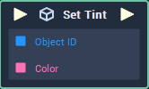

# Set Tint

## Overview

**Set Tint** adds a `tint` color value to the _hue_ color of an **Object**.

The **Set Tint** node only works with objects that have **Sprite** category as an attribute such as **List**, **Image**, **Sequence**, **Web Sprite**, **Sprite** and **Text**.

## Attributes

| Attribute | Type | Description |
| :--- | :--- | :--- |
| `Object` | **ObjectID** | The **Object** whose _hue_ color is to be adjusted, if one is not provided in the `object ID` **Socket**. |
| `Color` | **Color** | The default value of the `Color` **Socket**, if no value is provided. |

## Inputs

| Input | Type | Description |
| :--- | :--- | :--- |
| _Pulse Input_ \(►\) | **Pulse** | A standard **Input Pulse**, to trigger the execution of the **Node**. |
| `Object` | **ObjectID** | The ID of the **Object** you would like to `tint`. |
| `Color` | **Color** | The `tint` value used to adjust the _hue_ color of the **Object**. |

## Outputs

| Output | Type | Description |
| :--- | :--- | :--- |
| _Pulse Output_ \(►\) | **Pulse** | A standard **Output Pulse**, to move onto the next **Node** along the **Logic Branch**, once this **Node** has finished its execution. |

## See Also

* [**Get Tint**](get-tint.md)

## External Links

* [_Tints and Shades_](https://en.wikipedia.org/wiki/Tints_and_shades) on wikipedia.

