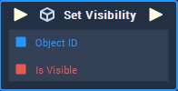

# Set Visibility

## Overview

**Set Visibility** makes an **Object** either visible or not visible in a **Scene**.

## Attributes

| Attribute | Type | Description |
| :--- | :--- | :--- |
| `Object` | **ObjectID** | The **Object** that you wish to _set visibility_ of, if one is not provided in the `object ID` **Socket**. |
| `Is Visible` | **Bool** | A **Boolean** indicating whether a desired **Object** is set to _visible_ or not. The default value is `true`. |

## Inputs

| Input | Type | Description |
| :--- | :--- | :--- |
| _Pulse Input_ \(►\) | **Pulse** | A standard **Input Pulse**, to trigger the execution of the **Node**. |
| `Object` | **ObjectID** | The ID of the **Object** you would like to make _visible_ or not. |
| `Is Visible` | **Bool** | An input **Boolean** that sets the **Object** **Visibility** to either _true_ or _false_. |

## Outputs

| Output | Type | Description |
| :--- | :--- | :--- |
| _Pulse Output_ \(►\) | **Pulse** | A standard **Output Pulse**, to move onto the next **Node** along the **Logic Branch**, once this **Node** has finished its execution. |

## See Also

* [**Get Visibility**](get-visibility.md)

