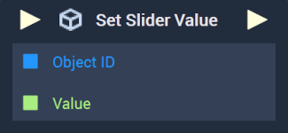
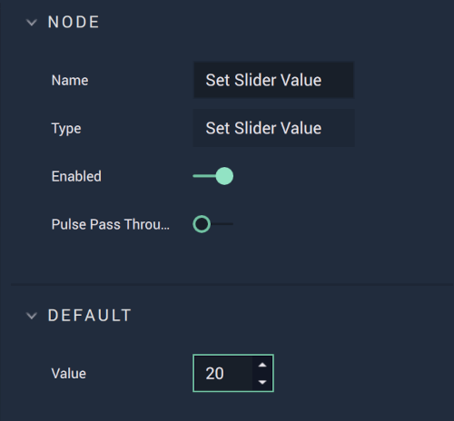

# Overview

The **Set Slider Value Node** sets the value of the [**Slider's**](../../../objects-and-types/scene2d-objects/gui.md#slider) placement on its handle. 

[**Scope**](../../overview.md#scopes): **Scene**, **Function**, **Prefab**.

# Attributes

|Attribute|Type|Description|
|---|---|---|
|`Value`|**Int**|The desired `Value` of the **Slider's** placement, if one is not provided in the `Value` **Socket**.|

# Inputs

|Input|Type|Description|
|---|---|---|
|*Pulse Input* (►)|**Pulse**|A standard **Input Pulse**, to trigger the execution of the **Node**.|
|`Object ID`|**ObjectID**|The **Slider Object** whose value shall be set.|
|`Value`|**Int**|The desired `Value` of the **Slider's** placement.|

# Outputs

|Output|Type|Description|
|---|---|---|
|*Pulse Output* (►)|**Pulse**|A standard **Output Pulse**, to move onto the next **Node** along the **Logic Branch**, once this **Node** has finished its execution.|

# See Also

* [**Get Slider Value**](getslidervalue.md)

