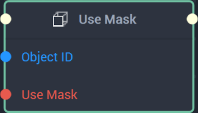

# Overview

The **Use Mask** Node allows the user to enable or disable an **Object's** **Mask** from the **Logic Editor**.

[**Scope**](../../overview.md#scopes): **Scene**, **Function**, **Prefab**.

# Inputs

|Input|Type|Description|
|---|---|---|
|*Pulse Input* (►)|**Pulse**|A standard **Input Pulse**, to trigger the execution of the **Node**.|
|`Object ID`|**ObjectID**|The **Object** that will have its **Mask** enabled/disabled.|
|`Use Mask`|**Boolean**|*True* enables the **Mask**, while *False* disables it.|

# Outputs

|Output|Type|Description|
|---|---|---|
|*Pulse Output* (►)|**Pulse**|A standard **Output Pulse**, to move onto the next **Node** along the **Logic Branch**, once this **Node** has finished its execution.|

# See Also

[**Set Mask**](set-mask.md)

