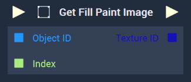
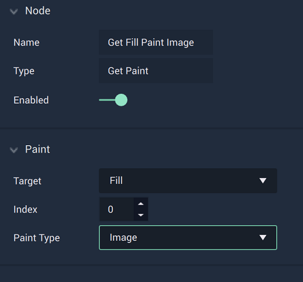

# Get Paint

This **Node** has different versions based on whether `Color` or `Image` is chosen in the **Attributes**. 




## Overview

The **Get Paint Node** returns the value of the fill or stroke's `Paint Type` selected in the **Attributes**.

[**Scope**](../../overview.md#scopes): **Scene**, **Function**, **Prefab**.

## Attributes

|Attribute|Type|Description|
|---|---|---|
|`Target`|**Dropdown**|Can be either `Fill` or `Stroke`. In the image above, `Fill` has been chosen.|
|`Index`|**Int**|Determines the layer of the paint content, if one is not provided in the **Input Socket**. It works in a top to bottom way, where 0 is the top layer and increasing layers are below it.|
|`Paint Type`|**Dropdown**|The type of content that was used on the inputted **Object**. The choices are `Color`or `Image`. In this case, `Color` has been chosen.| 

## Inputs

|Input|Type|Description|
|---|---|---|
|*Pulse Input* (►)|**Pulse**|A standard **Input Pulse**, to trigger the execution of the **Node**.|
|`Object ID`|**ObjectID**|The ID of the **Object** that will have its fill or stroke returned (depending on the `Target` **Attribute**).|
|`Index`|**Int**|The index of the fill or stroke’s layer.| 

## Outputs

|Output|Type|Description|
|---|---|---|
|*Pulse Output* (►)|**Pulse**|A standard **Output Pulse**, to move onto the next **Node** along the **Logic Branch**, once this **Node** has finished its execution.|
|`Color`|**Color**|The returned color of the chosen **Object's** fill or stroke.|





## Overview

The **Get Paint Node** returns the value of the fill or stroke's `Paint Type` selected in the **Attributes**.

[**Scope**](../../overview.md#scopes): **Scene**, **Function**, **Prefab**.

## Attributes

|Attribute|Type|Description|
|---|---|---|
|`Target`|**Dropdown**|Can be either `Fill` or `Stroke`. In the image above, `Fill` has been chosen.|
|`Index`|**Int**|Determines the layer of the paint content, if one is not provided in the **Input Socket**. It works in a top to bottom way, where 0 is the top layer and increasing layers are below it.|
|`Paint Type`|**Dropdown**|The type of content that was used on the inputted **Object**. The choices are `Color`or `Image`. In this case, `Image` has been chosen.| 

## Inputs

|Input|Type|Description|
|---|---|---|
|*Pulse Input* (►)|**Pulse**|A standard **Input Pulse**, to trigger the execution of the **Node**.|
|`Object ID`|**ObjectID**|The ID of the **Object** that will have its fill or stroke returned (depending on the `Target` **Attribute**).|
|`Index`|**Int**|The index of the fill or stroke’s layer.| 

## Outputs

|Output|Type|Description|
|---|---|---|
|*Pulse Output* (►)|**Pulse**|A standard **Output Pulse**, to move onto the next **Node** along the **Logic Branch**, once this **Node** has finished its execution.|
|`Texture ID`|**TextureID**|The ID of the returned image of the chosen **Object's** fill or stroke.|




# See Also

* [**Set Paint**](setpaint.md)

