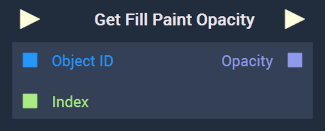
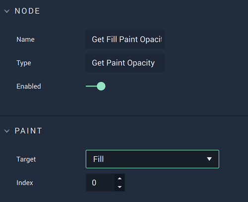
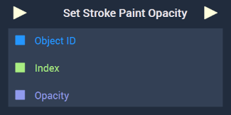
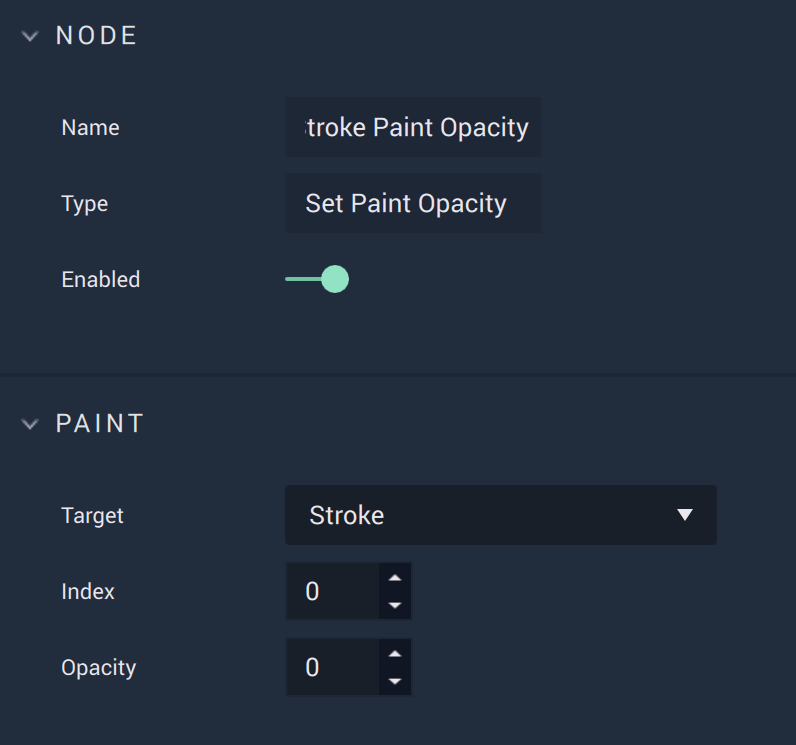

# Get Paint Opacity

This **Node** has different versions based on whether `Fill` or `Stroke` is set in the **Attributes**. 




## Overview

The **Get Fill Paint Opacity Node** .

[**Scope**](../../overview.md#scopes): **Scene**, **Function**, **Prefab**.

## Attributes

|Attribute|Type|Description|
|---|---|---|

## Inputs

|Input|Type|Description|
|---|---|---|
|*Pulse Input* (►)|**Pulse**|A standard **Input Pulse**, to trigger the execution of the **Node**.|

## Outputs

|Output|Type|Description|
|---|---|---|
|*Pulse Output* (►)|**Pulse**|A standard **Output Pulse**, to move onto the next **Node** along the **Logic Branch**, once this **Node** has finished its execution.|





## Overview

The **Set Stroke Paint Opacity Node** .

[**Scope**](../../overview.md#scopes): **Scene**, **Function**, **Prefab**.

## Attributes

|Attribute|Type|Description|
|---|---|---|

## Inputs

|Input|Type|Description|
|---|---|---|
|*Pulse Input* (►)|**Pulse**|A standard **Input Pulse**, to trigger the execution of the **Node**.|

## Outputs

|Output|Type|Description|
|---|---|---|
|*Pulse Output* (►)|**Pulse**|A standard **Output Pulse**, to move onto the next **Node** along the **Logic Branch**, once this **Node** has finished its execution.|




# See Also

# External Links

