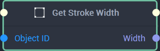

# Overview

The **Get Stroke Width Node** returns the `Stroke` width of the inputted **Object** from a **Scene2D**.

[**Scope**](../../overview.md#scopes): **Scene**, **Function**, **Prefab**.

# Inputs

|Input|Type|Description|
|---|---|---|
|*Pulse Input* (►)|**Pulse**|A standard **Input Pulse**, to trigger the execution of the **Node**.|
|`Object ID`|**ObjectID**|The ID of the *2D* **Object** that will have its `Stroke` width returned.|

# Outputs

|Output|Type|Description|
|---|---|---|
|*Pulse Output* (►)|**Pulse**|A standard **Output Pulse**, to move onto the next **Node** along the **Logic Branch**, once this **Node** has finished its execution.|
|`Width`|**Float**|The `Stroke` width of the inputted *2D* **Object**.|

# See Also

* [**Set Stroke Width**](setstrokewidth.md)

