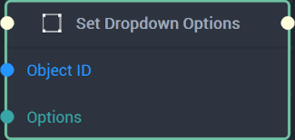

# Overview

The **Set Dropdown Options Node** sets a [**Dropdown Object's**](../../../objects-and-types/scene2d-objects/gui/dropdown.md) `Options` using an **Array**. These `Options` are the **Strings** that act as the **Dropdown Object's** choices, thus the **Array** should only consist of **Strings**. 

Please note that when using the **Set Dropdown Options Node** on a **Dropdown Object** that already has `Options`, the **Node's** `Options` will override what was already there and will completely replace them.

[**Scope**](../../overview.md#scopes): **Scene**, **Function**, **Prefab**.

# Inputs

|Input|Type|Description|
|---|---|---|
|*Pulse Input* (►)|**Pulse**|A standard **Input Pulse**, to trigger the execution of the **Node**.|
|`Object ID`|**ObjectID**|The **Dropdown Object** whose `Options` will be set.|
|`Options`|**Array**|The `Options` of the inputted **Dropdown Object** to be set.|

# Outputs

|Output|Type|Description|
|---|---|---|
|*Pulse Output* (►)|**Pulse**|A standard **Output Pulse**, to move onto the next **Node** along the **Logic Branch**, once this **Node** has finished its execution.|

# See Also

* [**Get Dropdown Options**](get-dropdown-options.md)
