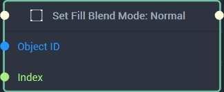
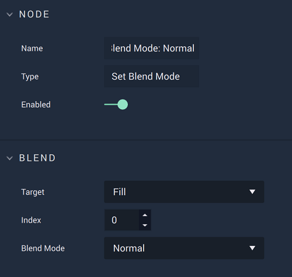
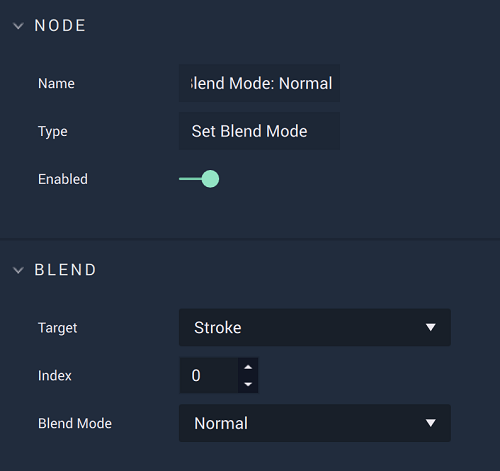
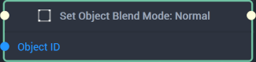
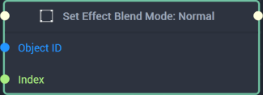
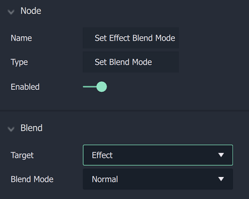

# Set Blend Mode

This **Node** has different versions based on whether `Fill`,`Stroke`, or `Object` is set in the **Attributes**.



# Overview

The **Set Fill Blend Mode Node** allows the user to change an **Object** fill’s *blend mode*. This is chosen in the **Attributes** with `Blend Mode`.

[**Scope**](../../overview.md#scopes): **Scene**, **Function**, **Prefab**.

# Attributes

|Attribute|Type|Description|
|---|---|---|
|`Target`|**Dropdown**|The type of content that will have its *blend mode* changed. The options are `Fill`, `Stroke`, `Object`, and `Effect`. For this **Node**, `Fill` has been selected.|
|`Index`|**Int**|Determines the layer of the fill content, if one is not provided in the **Input Socket**. It works in a top to bottom way, where 0 is the top layer and increasing layers are below it. |
|`Blend Mode`|**Dropdown**|The desired *blend mode*. More information on these can be found [here](http://www.simplefilter.de/en/basics/mixmods.html). |

# Inputs

|Input|Type|Description|
|---|---|---|
|*Pulse Input* (►)|**Pulse**|A standard **Input Pulse**, to trigger the execution of the **Node**.|
|`Object ID`|**ObjectID**|The ID of the **Object** that will have its fill’s *blend mode* set.|
|`Index`|**Int**|The index of the fill’s layer.|

# Outputs

|Output|Type|Description|
|---|---|---|
|*Pulse Output* (►)|**Pulse**|A standard **Output Pulse**, to move onto the next **Node** along the **Logic Branch**, once this **Node** has finished its execution.|





# Overview

**Set Stroke Blend Mode Node** allows the user to change an **Object** stroke's *blend mode*. This is chosen in the **Attributes** with `Blend Mode`.

[**Scope**](../../overview.md#scopes): **Scene**, **Function**, **Prefab**.

# Attributes

|Attribute|Type|Description|
|---|---|---|
|`Target`|**Dropdown**|The type of content that will have its *blend mode* changed. The options are `Fill`, `Stroke`, `Object`, and `Effect`. For this **Node**, `Stroke` has been selected.|
|`Index`|**Int**|Determines the layer of the stroke content, if one is not provided in the **Input Socket**. It works in a top to bottom way, where 0 is the top layer and increasing layers are below it. |
|`Blend Mode`|**Dropdown**|The desired *blend mode*. More information on these can be found [here](http://www.simplefilter.de/en/basics/mixmods.html).|

# Inputs

|Input|Type|Description|
|---|---|---|
|*Pulse Input* (►)|**Pulse**|A standard **Input Pulse**, to trigger the execution of the **Node**.|
|`Object ID`|**ObjectID**|The ID of the **Object** that will have its stroke's *blend mode* set.|
|`Index`|**Int**|The index of the stroke's layer.|

# Outputs

|Output|Type|Description|
|---|---|---|
|*Pulse Output* (►)|**Pulse**|A standard **Output Pulse**, to move onto the next **Node** along the **Logic Branch**, once this **Node** has finished its execution.|





# Overview

**Set Object Blend Mode Node** allows the user to change an **Object's** *blend mode*. This is chosen in the **Attributes** with `Blend Mode`.

[**Scope**](../../overview.md#scopes): **Scene**, **Function**, **Prefab**.

# Attributes

|Attribute|Type|Description|
|---|---|---|
|`Target`|**Dropdown**|The type of content that will have its *blend mode* changed. The options are `Fill`, `Stroke`, `Object`, and `Effect`. For this **Node**, `Object` has been selected.|
|`Blend Mode`|**Dropdown**|The desired *blend mode*. More information on these can be found [here](http://www.simplefilter.de/en/basics/mixmods.html).|

# Inputs

|Input|Type|Description|
|---|---|---|
|*Pulse Input* (►)|**Pulse**|A standard **Input Pulse**, to trigger the execution of the **Node**.|
|`Object ID`|**ObjectID**|The ID of the **Object** that will have its stroke's *blend mode* set.|

# Outputs

|Output|Type|Description|
|---|---|---|
|*Pulse Output* (►)|**Pulse**|A standard **Output Pulse**, to move onto the next **Node** along the **Logic Branch**, once this **Node** has finished its execution.|





# Overview

**Set Effect Blend Mode Node** allows the user to change an **Object's** *blend mode*. This is chosen in the **Attributes** with `Blend Mode`.

[**Scope**](../../overview.md#scopes): **Scene**, **Function**, **Prefab**.

# Attributes

|Attribute|Type|Description|
|---|---|---|
|`Target`|**Dropdown**|The type of content that will have its *blend mode* changed. The options are `Fill`, `Stroke`, `Object`, and `Effect`. For this **Node**, `Effect` has been selected.|
|`Blend Mode`|**Dropdown**|The desired *blend mode*. More information on these can be found [here](http://www.simplefilter.de/en/basics/mixmods.html).|

# Inputs

|Input|Type|Description|
|---|---|---|
|*Pulse Input* (►)|**Pulse**|A standard **Input Pulse**, to trigger the execution of the **Node**.|
|`Object ID`|**ObjectID**|The ID of the **Object** that will have its stroke's *blend mode* set.|

# Outputs

|Output|Type|Description|
|---|---|---|
|*Pulse Output* (►)|**Pulse**|A standard **Output Pulse**, to move onto the next **Node** along the **Logic Branch**, once this **Node** has finished its execution.|




# External Links

* More on blend modes [*here*](http://www.simplefilter.de/en/basics/mixmods.html)

