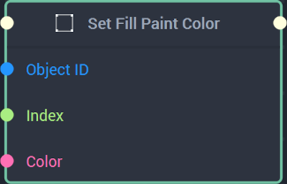
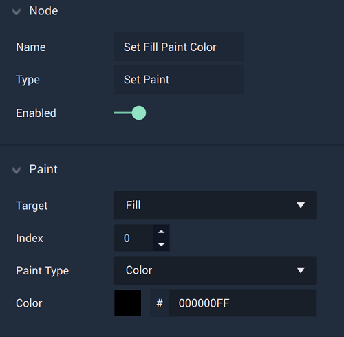
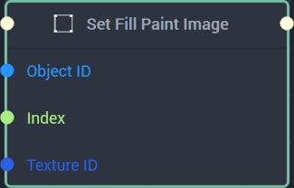
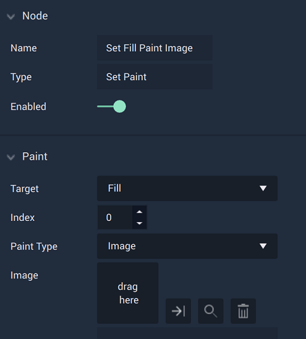

# Set Paint

This **Node** has different versions based on whether `Color` or `Image` is chosen in the **Attributes**. 




## Overview

The **Set Paint Node** sets the value of the fill or stroke's `Paint Type` selected in the **Attributes**.

[**Scope**](../../overview.md#scopes): **Scene**, **Function**, **Prefab**.

## Attributes

|Attribute|Type|Description|
|---|---|---|
|`Target`|**Dropdown**|Can be either `Fill` or `Stroke`. In the image above, `Fill` has been chosen.|
|`Index`|**Int**|Determines the layer of the paint content, if one is not provided in the **Input Socket**. It works in a top to bottom way, where 0 is the top layer and increasing layers are below it.|
|`Paint Type`|**Dropdown**|The type of content that will be used on the inputted **Object**. The choices are `Color`or `Image`. In this case, `Color` has been chosen.| 
|`Color`|**Color Selector**|If `Paint Type` is set to **Color**, this additional **Attribute** appears. It allows the user to set the color of the paint content for the inputted **Object**, if one is not already provided in the **Input Socket**.

## Inputs

|Input|Type|Description|
|---|---|---|
|*Pulse Input* (►)|**Pulse**|A standard **Input Pulse**, to trigger the execution of the **Node**.|
|`Object ID`|**ObjectID**|The ID of the **Object** that will have its fill or stroke set (depending on the `Target` **Attribute**).|
|`Index`|**Int**|The index of the fill or stroke’s layer.| 
|`Color`|**Color**|The color of the `Target` **Object's** fill or stroke to be set.|

## Outputs

|Output|Type|Description|
|---|---|---|
|*Pulse Output* (►)|**Pulse**|A standard **Output Pulse**, to move onto the next **Node** along the **Logic Branch**, once this **Node** has finished its execution.|





## Overview

The **Set Paint Node** returns the value of the fill or stroke's `Paint Type` selected in the **Attributes**.

[**Scope**](../../overview.md#scopes): **Scene**, **Function**, **Prefab**.

## Attributes

|Attribute|Type|Description|
|---|---|---|
|`Target`|**Dropdown**|Can be either `Fill` or `Stroke`. In the image above, `Fill` has been chosen.|
|`Index`|**Int**|Determines the layer of the paint content, if one is not provided in the **Input Socket**. It works in a top to bottom way, where 0 is the top layer and increasing layers are below it.|
|`Paint Type`|**Dropdown**|The type of content that will be used on the inputted **Object**. The choices are `Color`or `Image`. In this case, `Image` has been chosen.| 

## Inputs

|Input|Type|Description|
|---|---|---|
|*Pulse Input* (►)|**Pulse**|A standard **Input Pulse**, to trigger the execution of the **Node**.|
|`Object ID`|**ObjectID**|The ID of the **Object** that will have its fill or stroke set (depending on the `Target` **Attribute**).|
|`Index`|**Int**|The index of the fill or stroke’s layer.| 
|`Texture ID`|**TextureID**|The ID of the image of the chosen **Object's** fill or stroke to be set.|

## Outputs

|Output|Type|Description|
|---|---|---|
|*Pulse Output* (►)|**Pulse**|A standard **Output Pulse**, to move onto the next **Node** along the **Logic Branch**, once this **Node** has finished its execution.|




# See Also

* [**Get Paint**](getpaint.md)