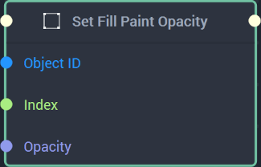
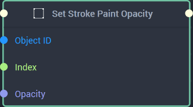

# Set Paint Opacity

This **Node** has different versions based on whether `Fill` or `Stroke` is set in the **Attributes**. 




## Overview

The **Set Paint Node** sets the fill's `Opacity` -- meaning how opaque or transparent it appears -- of the selected **Object** at the specified layer indicated by the `Index`.

[**Scope**](../../overview.md#scopes): **Scene**, **Function**, **Prefab**.

## Attributes

|Attribute|Type|Description|
|---|---|---|
|`Target`|**Dropdown**|Can be either `Fill` or `Stroke`. In this case, `Fill` has been chosen.|
|`Index`|**Int**|Determines the layer of the fill content, if one is not provided in the **Input Socket**. It works in a top to bottom way, where 0 is the top layer and increasing layers are below it.|
|`Opacity`|**Float**|How opaque or transparent the fill will appear, if no value is provided in the **Input Socket**.|

## Inputs

|Input|Type|Description|
|---|---|---|
|*Pulse Input* (►)|**Pulse**|A standard **Input Pulse**, to trigger the execution of the **Node**.|
|`Object ID`|**ObjectID**|The ID of the **Object** that will have its fill's `Opacity` set.|
|`Index`|**Int**|The index of the fill’s layer.| 
|`Opacity`|**Float**|The fill's opacity of the selected **Object** at the specified layer.|

## Outputs

|Output|Type|Description|
|---|---|---|
|*Pulse Output* (►)|**Pulse**|A standard **Output Pulse**, to move onto the next **Node** along the **Logic Branch**, once this **Node** has finished its execution.|





## Overview

The **Set Paint Node** sets the stroke's `Opacity` -- meaning how opaque or transparent it appears -- of the selected **Object** at the specified layer indicated by the `Index`.

[**Scope**](../../overview.md#scopes): **Scene**, **Function**, **Prefab**.

## Attributes

|Attribute|Type|Description|
|---|---|---|
|`Target`|**Dropdown**|Can be either `Fill` or `Stroke`. In this case, `Stroke` has been chosen.|
|`Index`|**Int**|Determines the layer of the stroke content, if one is not provided in the **Input Socket**. It works in a top to bottom way, where 0 is the top layer and increasing layers are below it.|
|`Opacity`|**Float**|How opaque or transparent the stroke will appear, if no value is provided in the **Input Socket**.|

## Inputs

|Input|Type|Description|
|---|---|---|
|*Pulse Input* (►)|**Pulse**|A standard **Input Pulse**, to trigger the execution of the **Node**.|
|`Object ID`|**ObjectID**|The ID of the **Object** that will have its stroke's `Opacity` set.|
|`Index`|**Int**|The index of the stroke's layer.| 
|`Opacity`|**Float**|The stroke's opacity of the selected **Object** at the specified layer.|

## Outputs

|Output|Type|Description|
|---|---|---|
|*Pulse Output* (►)|**Pulse**|A standard **Output Pulse**, to move onto the next **Node** along the **Logic Branch**, once this **Node** has finished its execution.|




# See Also

* [**Get Paint Opacity**](getpaintopacity.md)

