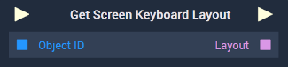
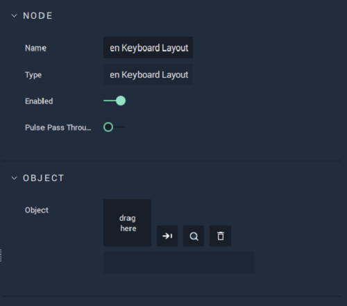

# Overview

The **Get Screen Keyboard Layout** **Node** outputs the *layout* of an **On-Screen Keyboard**, which has to be given as an input either in the **Input Socket** or the **Attributes**.

[**Scope**](../../overview.md#scopes): **Scene**, **Function**, **Prefab**.

# Attributes

|Attribute|Type|Description|
|---|---|---|
| `Object` | **ObjectID** | **On-Screen Keyboard** whose *layout* you wish to obtain, if none is given in the **Input Socket**. |

# Inputs

|Input|Type|Description|
|---|---|---|
|*Pulse Input* (►)|**Pulse**|A standard **Input Pulse**, to trigger the execution of the **Node**.|
| `Object ID` | **ObjectID** | **On-Screen Keyboard** whose *layout* you wish to obtain. |

# Outputs

|Output|Type|Description|
|---|---|---|
|*Pulse Output* (►)|**Pulse**|A standard **Output Pulse**, to move onto the next **Node** along the **Logic Branch**, once this **Node** has finished its execution.|
| `Layout` | **String** | *Layout* of the **On-Screen Keyboard** received as input.|

# See Also

* [**Set Screen Keyboard Layout**](setscreenkeyboardlayout.md)

