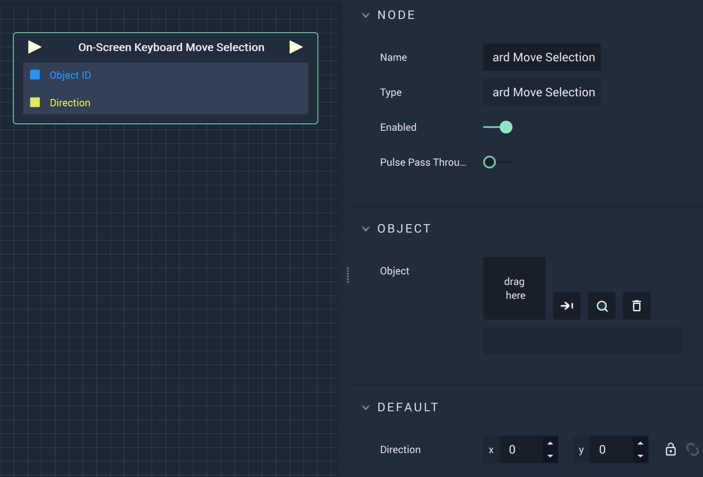

# Overview

The **On-Screen Keyboard Move Selection Node** moves the selection from a previous one.

# Attributes

|Attribute|Type|Description|
|---|---|---|
|`Object`|**ObjectID**|The target **Object**.|
|`Direction`|**Vector2**|The XY-coordinates for the desired `Direction`.|

# Inputs

|Input|Type|Description|
|---|---|---|
|*Pulse Input* (►)|**Pulse**|A standard **Input Pulse**, to trigger the execution of the **Node**.|
|`Object ID`|**ObjectID**|The ID of the target **Object**.| 
|`Direction`|**Vector2**|A **Vector2 Variable** that assigns XY-coordinates as input.|

# Outputs

|Output|Type|Description|
|---|---|---|
|*Pulse Output* (►)|**Pulse**|A standard **Output Pulse**, to move onto the next **Node** along the **Logic Branch**, once this **Node** has finished its execution.|

# See Also

* [**On-Screen Keyboard Clear Input**](onscreenkeyboardclearinput.md)
* [**On-Screen Keyboard Get Input**](onscreenkeyboardgetinput.md)
* [**On-Screen Keyboard Press Button**](onscreenkeyboardpressbutton.md)

# External Links

