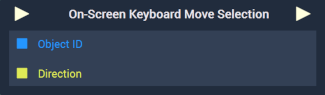
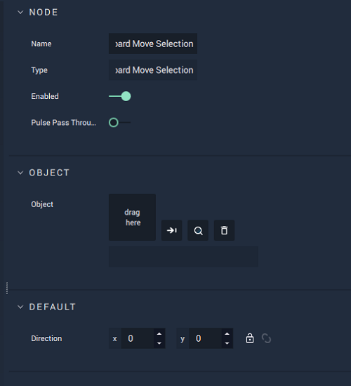

# Overview

The **On-Screen Keyboard Move Selection Node** moves the selection from a previous one using the `Direction` **Attribute**, which is a **Vector2**. 

This **Node** moves the selected **On-Screen Keyboard Button** in the `Direction` across the X axis, the Y axis, or both. If the first element of the **Vector2** (X-coordinate) is positive then it moves to the right, if it is 0 it doesn't move horizontally, and if it is negative it moves to the left. If the second element of the **Vector2** (Y-coordinate) is positive then it moves down, if it is 0 it doesn't move vertically, and if it is negative it moves up.

[**Scope**](../../overview.md#scopes): **Scene**, **Function**, **Prefab**.

# Attributes

|Attribute|Type|Description|
|---|---|---|
|`Object`|**ObjectID**|The target **Object**.|
|`Direction`|**Vector2**|The XY-coordinates for the desired `Direction`.|

# Inputs

|Input|Type|Description|
|---|---|---|
|*Pulse Input* (►)|**Pulse**|A standard **Input Pulse**, to trigger the execution of the **Node**.|
|`Object ID`|**ObjectID**|The ID of the target **Object**.| 
|`Direction`|**Vector2**|A **Vector2** that assigns XY-coordinates as input.|

# Outputs

|Output|Type|Description|
|---|---|---|
|*Pulse Output* (►)|**Pulse**|A standard **Output Pulse**, to move onto the next **Node** along the **Logic Branch**, once this **Node** has finished its execution.|

# See Also

* [**On-Screen Keyboard Clear Input**](onscreenkeyboardclearinput.md)
* [**On-Screen Keyboard Get Input**](onscreenkeyboardgetinput.md)
* [**On-Screen Keyboard Press Button**](onscreenkeyboardpressbutton.md)

