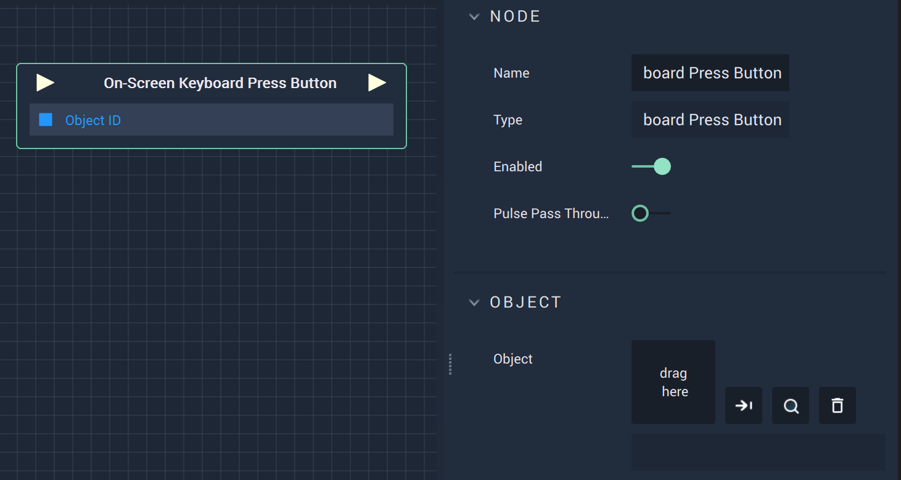

# Overview

The **On-Screen Keyboard Press Button Node** is a **Node** that takes place of a clicking action.

# Attributes

|Attribute|Type|Description|
|---|---|---|
|**Object**|**ObjectID**|The target **Object**.|

# Inputs

|Input|Type|Description|
|---|---|---|
|*Pulse Input* (►)|**Pulse**|A standard **Input Pulse**, to trigger the execution of the **Node**.|
|**Object ID**|**ObjectID**|The ID of the target **Object**.|

# Outputs

|Output|Type|Description|
|---|---|---|
|*Pulse Output* (►)|**Pulse**|A standard **Output Pulse**, to move onto the next **Node** along the **Logic Branch**, once this **Node** has finished its execution.|

# See Also

* [**On-Screen Keyboard Clear Input**](onscreenkeyboardclearinput.md)
* [**On-Screen Keyboard Get Input**](onscreenkeyboardgetinput.md)
* [**On-Screen Keyboard Move Selection**](onscreenkeyboardmoveselection.md)

