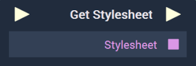

# Overview

The **Get Stylesheet Node** returns the stylesheet **Asset** of the current [**Scene2D**](../../../objects-and-types/project-objects/scene2d.md).

[**Scope**](../../overview.md#scopes): **Scene**, **Function**, **Prefab**.

# Inputs

|Input|Type|Description|
|---|---|---|
|*Pulse Input* (►)|**Pulse**|A standard **Input Pulse**, to trigger the execution of the **Node**.|

# Outputs

|Output|Type|Description|
|---|---|---|
|*Pulse Output* (►)|**Pulse**|A standard **Output Pulse**, to move onto the next **Node** along the **Logic Branch**, once this **Node** has finished its execution.|
|`Stylesheet`|**String**|Returns the current stylesheet **Asset**.|

