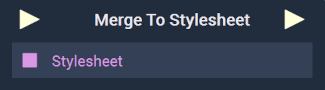

# Overview

The **Merge To Stylesheet Node** lets the user incorporate new data into the current [**Scene2D's**](../../../objects-and-types/project-objects/scene2d.md) stylesheet **Attribute**, without overwriting anything. It appends any new data to the end of the current stylesheet.

[**Scope**](../../overview.md#scopes): **Scene**, **Function**, **Prefab**.

# Inputs

|Input|Type|Description|
|---|---|---|
|*Pulse Input* (►)|**Pulse**|A standard **Input Pulse**, to trigger the execution of the **Node**.|
|`Stylesheet`|**String**|The *CSS* data that the user wishes to merge into the current stylesheet **Asset**.|

# Outputs

|Output|Type|Description|
|---|---|---|
|*Pulse Output* (►)|**Pulse**|A standard **Output Pulse**, to move onto the next **Node** along the **Logic Branch**, once this **Node** has finished its execution.|

