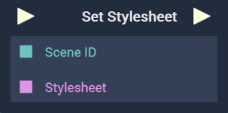

# Overview

The **Set Stylesheet Node** replaces the current stylesheet **Asset** that was added to the [**Scene2D's**](../../../objects-and-types/project-objects/scene2d.md) stylesheet **Attribute**.

[**Scope**](../../overview.md#scopes): **Scene**, **Function**, **Prefab**.

# Inputs

|Input|Type|Description|
|---|---|---|
|*Pulse Input* (►)|**Pulse**|A standard **Input Pulse**, to trigger the execution of the **Node**.|
|`Stylesheet`|**String**|The stylesheet that will replace the current stylesheet.|
|`Scene ID`|**SceneID**|The **ID** of the desired **Scene2D** that will have its stylesheet set.|

# Outputs

|Output|Type|Description|
|---|---|---|
|*Pulse Output* (►)|**Pulse**|A standard **Output Pulse**, to move onto the next **Node** along the **Logic Branch**, once this **Node** has finished its execution.|

