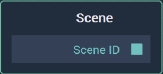

# Overview

The **Scene** **Node** gives the **Scene ID** of its corresponding **Scene**.

For each **Scene** in the **Project**, there is a **Scene** **Node** with the **Scene** name. 

[**Scope**](../../overview.md#scopes): **Project**.

# Attributes

|Attribute|Type|Description|
|---|---|---|
| `Scene` | `SceneID` | **Scene** whose **Scene ID** the **Node** will output. |

# Outputs

|Output|Type|Description|
|---|---|---|
| `Scene`   | `Scene ID` | **Scene ID** of the corresponding **Scene**.    |

