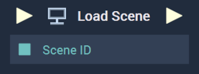

# Overview

The **Load Scene Node** loads the specified **Scene**. This can be particularly useful in tandem with the [**Set Scene Node**](setscene.md).

Please note that **Scene Separation** must be enabled in the [**Project Settings**](../../../modules/project-settings/sceneseparation.md).

[**Scope**](../../overview.md#scopes): **Project**, **Scene**, **Function**, **Prefab**.

# Inputs

|Input|Type|Description|
|---|---|---|
|*Pulse Input* (►)|**Pulse**|A standard **Input Pulse**, to trigger the execution of the **Node**.|
|`Scene ID`|**SceneID**|The ID of the chosen **Scene** that will be loaded.|

# Outputs

|Output|Type|Description|
|---|---|---|
|*Pulse Output* (►)|**Pulse**|A standard **Output Pulse**, to move onto the next **Node** along the **Logic Branch**, once this **Node** has finished its execution.|

# See Also

* [**Set Scene**](setscene.md)
* [**On Scene Loaded**](../../events/scene/onsceneloaded.md)
* [**Unload Scene**](unloadscene.md)

