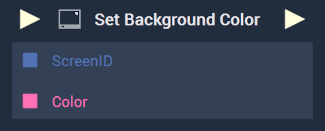
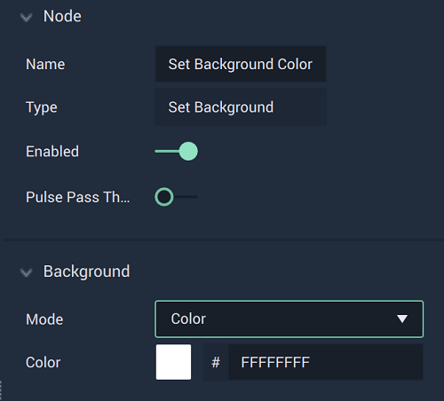
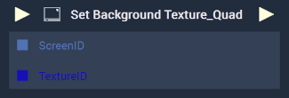
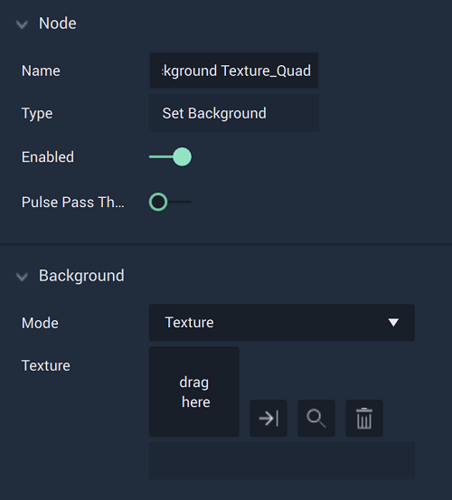
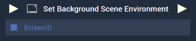
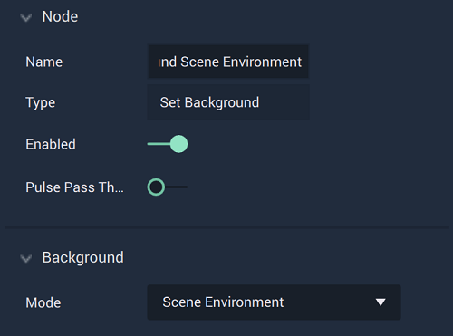
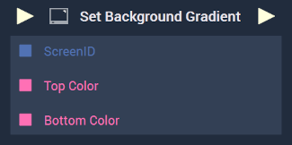

# Set Background

This **Node** has different versions based on what `Mode` is set in the **Attributes**. 




# Overview

The **Set Background Color Node** sets the `Color` for the inputted **Screen's** background.

[**Scope**](../../overview.md#scopes): **Project**, **Function**, **Prefab**.

# Attributes

|Attribute|Type|Description|
|---|---|---|
|`Mode`|**Dropdown**|The type of background that will be set. In this case, `Color` has been chosen. |
|`Color`|**Color Selector**|The color to be set for the **Screen's** background, if one is not provided in the **Input Socket**.|

# Inputs

|Input|Type|Description|
|---|---|---|
|*Pulse Input* (►)|**Pulse**|A standard **Input Pulse**, to trigger the execution of the **Node**.|
|`ScreenID`|**ScreenID**|The ID of the **Screen** that will have its background color set.|
|`Color`|**Color**|The color to be set for the **Screen's** background.|

# Outputs

|Output|Type|Description|
|---|---|---|
|*Pulse Output* (►)|**Pulse**|A standard **Output Pulse**, to move onto the next **Node** along the **Logic Branch**, once this **Node** has finished its execution.|





# Overview

The **Set Background Texture_Quad Node** sets the `Texture` for the inputted **Screen's** background.

[**Scope**](../../overview.md#scopes): **Project**, **Function**, **Prefab**.

# Attributes

|Attribute|Type|Description|
|---|---|---|
|`Mode`|**Dropdown**|The type of background that will be set. In this case, `Texture` has been chosen.| 
|`Texture`|**File Selector**|The **Texture** to be set for the **Screen's** background, if one is not provided in the **Input Socket**.|

# Inputs

|Input|Type|Description|
|---|---|---|
|*Pulse Input* (►)|**Pulse**|A standard **Input Pulse**, to trigger the execution of the **Node**.|
|`ScreenID`|**ScreenID**|The ID of the **Screen** that will have its background **Texture** set.|
|`TextureID`|**TextureID**|The **Texture** to be set for the **Screen's** background.|

# Outputs

|Output|Type|Description|
|---|---|---|
|*Pulse Output* (►)|**Pulse**|A standard **Output Pulse**, to move onto the next **Node** along the **Logic Branch**, once this **Node** has finished its execution.|





# Overview

The **Set Background Scene Environment Node** sets the `Scene Environment` for the inputted **Screen's** background. This is decided in the [Scene Environment](../../../objects-and-types/project-objects/screen.md#background) option in the **Screen's** `Background` **Attributes**.

[**Scope**](../../overview.md#scopes): **Project**, **Function**, **Prefab**.

# Attributes

|Attribute|Type|Description|
|---|---|---|
|`Mode`|**Dropdown**|The type of background that will be set. In this case, `Scene Environment` has been chosen. |

# Inputs

|Input|Type|Description|
|---|---|---|
|*Pulse Input* (►)|**Pulse**|A standard **Input Pulse**, to trigger the execution of the **Node**.|
|`ScreenID`|**ScreenID**|The ID of the **Screen** that will have its 





# Overview

The **Set Background Gradient Node** sets the `Gradient` for the inputted **Screen's** background.

[**Scope**](../../overview.md#scopes): **Project**, **Function**, **Prefab**.

# Attributes

|Attribute|Type|Description|
|---|---|---|
|`Mode`|**Dropdown**|The type of background that will be set. In this case, `Gradient` has been chosen.| 
|`Top Color`|**Color Selector**|The top color to be set for the **Screen's** gradient background, if one is not provided in the **Input Socket**.|
|`Bottom Color`|**Color Selector**|The bottom color to be set for the **Screen's** gradient background, if one is not provided in the **Input Socket**.|

# Inputs

|Input|Type|Description|
|---|---|---|
|*Pulse Input* (►)|**Pulse**|A standard **Input Pulse**, to trigger the execution of the **Node**.|
|`ScreenID`|**ScreenID**|The ID of the **Screen** that will have its background gradient set.|
|`Top Color`|**Color Selector**|The top color to be set for the **Screen's** gradient background.|
|`Bottom Color`|**Color Selector**|The bottom color to be set for the **Screen's** gradient background.|

# Outputs

|Output|Type|Description|
|---|---|---|
|*Pulse Output* (►)|**Pulse**|A standard **Output Pulse**, to move onto the next **Node** along the **Logic Branch**, once this **Node** has finished its execution.|




