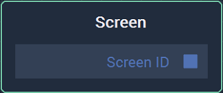
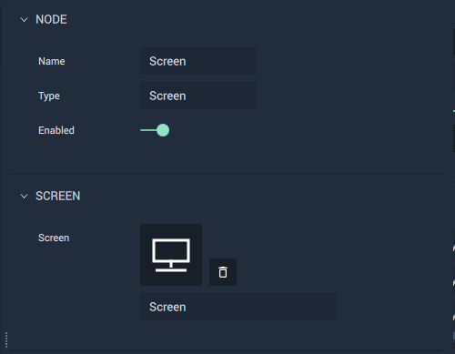

# Overview

The **Screen** **Node** gives the **Screen ID** of its corresponding **Screen**.

For each **Screen** in the **Project**, there is a **Screen** **Node** with the **Screen** name. 

[**Scope**](../../overview.md#scopes): **Project**.

# Attributes

|Attribute|Type|Description|
|---|---|---|
| `Screen` | `ScreenID` | **Screen** whose **Screen ID** the **Node** will output. |

# Outputs

|Output|Type|Description|
|---|---|---|
| `Screen`   | `ScreenID` | **Screen ID** of the corresponding **Screen**.    |