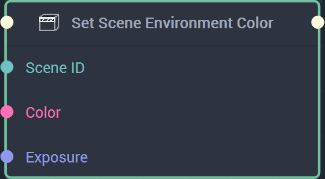

# Overview

The **Set Scene Environment Map** sets the **Environment Map** of a **Scene's** [`Environment Lighting`](../../objects-and-types/project-objects/scene.md) **Attribute** in the **Logic**.

[**Scope**](../overview.md#scopes): **Scene**.

# Inputs

|Input|Type|Description|
|---|---|---|
|*Pulse Input* (►)|**Pulse**|A standard **Input Pulse**, to trigger the execution of the **Node**.|
|`Scene ID`|**SceneID**|The ID of the **Scene** being referenced.|
|`Texture ID`|**TextureID**|The ID of the **Texture** to be used as the **Environment Map**.|
|`Color`|**Color**|The color the user wishes to set as a tint over the **Environment Map**.|
|`Exposure`|**Float**|The exposure value, or how bright or dark the **Environment Map** appears. This can be from 0 to infinity.|
|`Rotation`|**Float**|It sets the rotation, which ranges from 0 to 360 degrees. Basically, the beginning of the image of the provided **Environment Map** will be "delayed" in the *x* direction, moving it from left to right. The resulting "cut off" piece wraps around to the start of the image. |
|`Tilt`|**Float**|It sets the tilt, which ranges from -90 to 90 degrees. Basically, the beginning of the image of the provided `Texture` will be "delayed" in the *y* direction, moving it from bottom to top. The resulting "cut off" piece wraps around to the start of the image.|
|`Height`|**Float**|It sets the projection height, where the ‘point of visualization’ starts. If set to 50%, this would be halfway from the bottom of the image and it would display upwards from there. To see a visual example of this, please refer to the video linked [here](https://www.youtube.com/watch?v=7axPpWTcFrw). |

# Outputs

|Output|Type|Description|
|---|---|---|
|*Pulse Output* (►)|**Pulse**|A standard **Output Pulse**, to move onto the next **Node** along the **Logic Branch**, once this **Node** has finished its execution.|

# See Also

* [**Set Scene Environment Color**](setsceneenvironmentcolornode.md)
