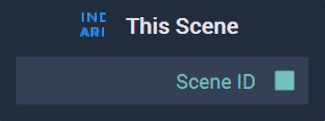

# This Scene

## Overview

The **This Scene Node** provides the ID of the current **Scene** being worked on.

[**Scope**](../overview.md#scopes): **Scene**.

## Outputs

| Output | Type | Description |
| :--- | :--- | :--- |
| `Scene ID` | **SceneID** | The ID of the target **Scene**. |

