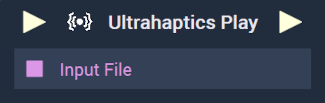

# Overview

The **Ultrahaptics Play Node** receives a JSON file generated by the *UltraHaptics Sensation Editor* (found [here](https://developer.ultrahaptics.com/downloads/sensation-editor/)). This allows the user to incorporate *UltraLeap* hand tracking into the **Incari Player**.

Before the JSON file can be hooked up as input, it must first be loaded with [**Load File**](../../io/loadfile.md).

Once all of this is completed, it is possible to trigger *haptics* sensations via **Incari Nodes**, meaning that the JSON file provides the instructions for the haptic that is to be played. 

Please refer to the [**External Links**](#external-links) for more information on *UltraLeap* technology. 

[**Scope**](../../overview.md#scopes): **Scene**, **Function**, **Prefab**.

# Inputs

|Input|Type|Description|
|---|---|---|
|*Pulse Input* (►)|**Pulse**|A standard **Input Pulse**, to trigger the execution of the **Node**.|
|`Input File`|**String**|The JSON file that describes that haptic(s) to be played.|

# Outputs

|Output|Type|Description|
|---|---|---|
|*Pulse Output* (►)|**Pulse**|A standard **Output Pulse**, to move onto the next **Node** along the **Logic Branch**, once this **Node** has finished its execution.|

# See Also

* [**Ultrahaptics Stop**](ultrahapticsstop.md)

# External Links

* [**UltraLeap Documentation**](https://docs.ultraleap.com/)
* [**Sensation Editor**](https://developer.ultrahaptics.com/downloads/sensation-editor/)

