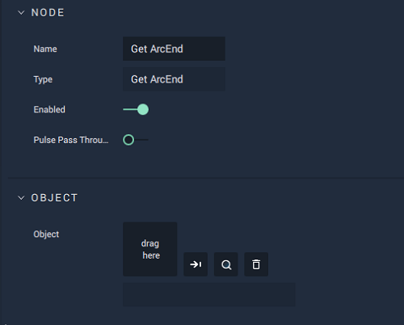

# Get ArcEnd

## Overview

The **Get ArcEnd Node** returns the ending _arc degree_ of an **Arc Object**.

[**Scope**](../overview.md#scopes):
*  **Scene**, **Function**, **Prefab**

## Attributes

| Attribute | Type | Description |
| :--- | :--- | :--- |
| `Object` | **ObjectID** | The target **Object**. |

## Inputs

| Input | Type | Description |
| :--- | :--- | :--- |
| _Pulse Input_ \(►\) | **Pulse** | A standard **Input Pulse**, to trigger the execution of the **Node**. |
| `Object ID` | **ObjectID** | The ID of the target **Object**. |

## Outputs

| Output | Type | Description |
| :--- | :--- | :--- |
| _Pulse Output_ \(►\) | **Pulse** | A standard **Output Pulse**, to move onto the next **Node** along the **Logic Branch**, once this **Node** has finished its execution. |
| `ArcEnd` | **Float** | The returned _arc degree_ of the **Object**. |

## See Also

* [**Set ArcStart**](setarcstart.md)
* [**Set ArcEnd**](setarcend.md)
* [**Get ArcStart**](getarcstart.md)

