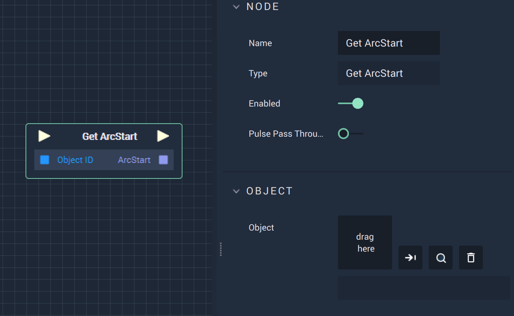

# Overview

The **Get Start Node** returns the starting *arc degree* of an **Object**.

# Attributes

|Attribute|Type|Description|
|---|---|---|
|`Object`|**ObjectID**|The target **Object**.|

# Inputs

|Input|Type|Description|
|---|---|---|
|*Pulse Input* (►)|**Pulse**|A standard **Input Pulse**, to trigger the execution of the **Node**.|
|`Object ID`|**ObjectID**|The ID of the taregt **Object**.|

# Outputs

|Output|Type|Description|
|---|---|---|
|*Pulse Output* (►)|**Pulse**|A standard **Output Pulse**, to move onto the next **Node** along the **Logic Branch**, once this **Node** has finished its execution.|
|`ArcStart`|**Float**|The returned *arc degree* of the **Object**.|

# See Also

* [**Set ArcStart**](setarcstart.md)
* [**Set ArcEnd**](setarcend.md)
* [**Get ArcEnd**](getarcend.md)
