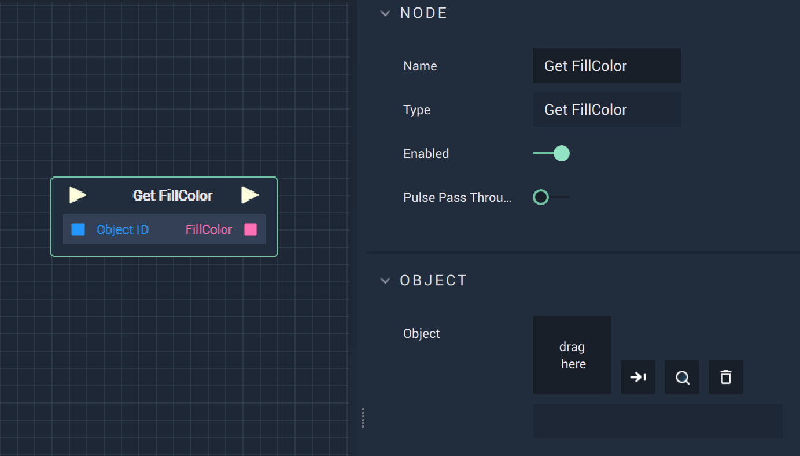

# Get FillColor

## Overview

The **Get FillColor Node** returns the **FillColor**, visualized as the inside color, of a **Vector Object** created in the **Scene Outliner Module** under _Vector_.

## Attributes

| Attribute | Type | Description |
| :--- | :--- | :--- |
| `Object` | **ObjectID** | The target **Object**. |

## Inputs

| Input | Type | Description |
| :--- | :--- | :--- |
| _Pulse Input_ \(►\) | **Pulse** | A standard **Input Pulse**, to trigger the execution of the **Node**. |
| `Object ID` | **ObjectID** | The ID of the target **Object**. |

## Outputs

| Output | Type | Description |
| :--- | :--- | :--- |
| _Pulse Output_ \(►\) | **Pulse** | A standard **Output Pulse**, to move onto the next **Node** along the **Logic Branch**, once this **Node** has finished its execution. |
| `FillColor` | **Color** | The **FillColor** of the target **Object**. |

## See Also

* [**Set FillColor**](setfillcolor.md)

