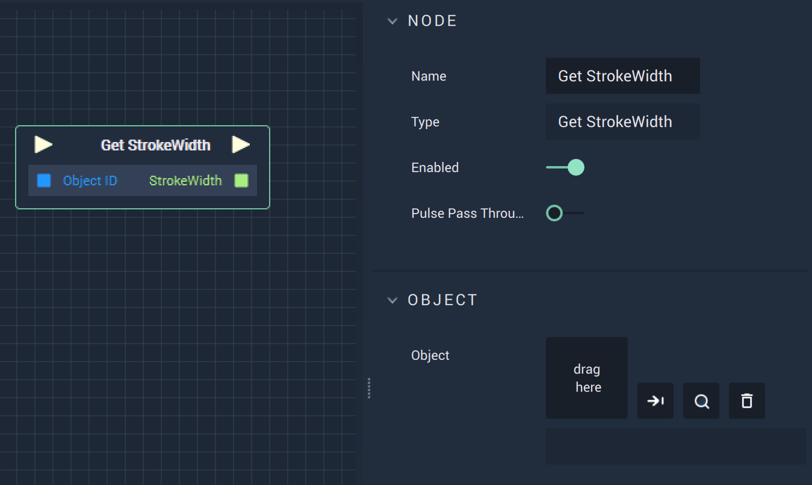

# Get StrokeWidth

## Overview

The **Get StrokeWidth Node** returns the **StrokeWidth** of a **Vector Object**, such as an **Ellipse**. **StrokeWidth** is an **Attribute** of a **Vector Object** that is visualized as the line drawn around the **Object**.

## Attributes

| Attribute | Type | Description |
| :--- | :--- | :--- |
| `Object` | **ObjectID** | The target **Object**. |

## Inputs

| Input | Type | Description |
| :--- | :--- | :--- |
| _Pulse Input_ \(►\) | **Pulse** | A standard **Input Pulse**, to trigger the execution of the **Node**. |
| `Object ID` | **ObjectID** | The ID of the target **Object**. |

## Outputs

| Output | Type | Description |
| :--- | :--- | :--- |
| _Pulse Output_ \(►\) | **Pulse** | A standard **Output Pulse**, to move onto the next **Node** along the **Logic Branch**, once this **Node** has finished its execution. |
| `StrokeWidth` | **Int** | The **StrokeWidth** of the target **Object**. |

## See Also

* [**Set StrokeWidth**](setstrokewidth.md)

